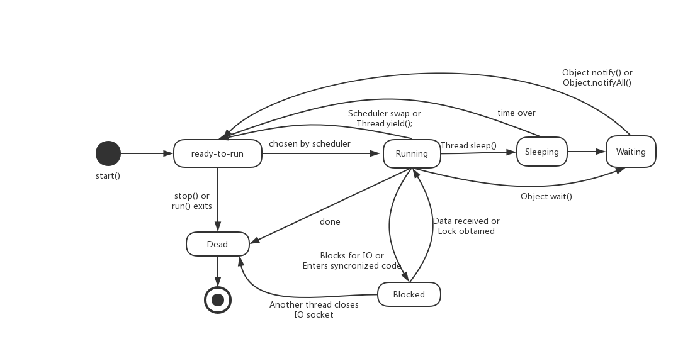

线程的一些基础概念：

* 守护线程(Daemon)
  * 开启守护线程setDaemon(true)
  * 主线程结束，那么守护线程没有执行完也会被终止

* 中断(interrupt)

  * 线程终止，释放资源（以前是使用stop()但是因为它没法释放资源就被废弃了）

  * 使用方式：thread.interrupt(); 

  * 判断方法：interrupted();如果已中断返回true

    ```java
     @Override
        public void run() {
            //如果线程没有终止就继续进行
            while(!interrupted()){
                System.out.println(getName()+"线程执行了...");
            }
            try {
                Thread.sleep(2000);
            } catch (InterruptedException e) {
                e.printStackTrace();
            }
        }
    
    ```

