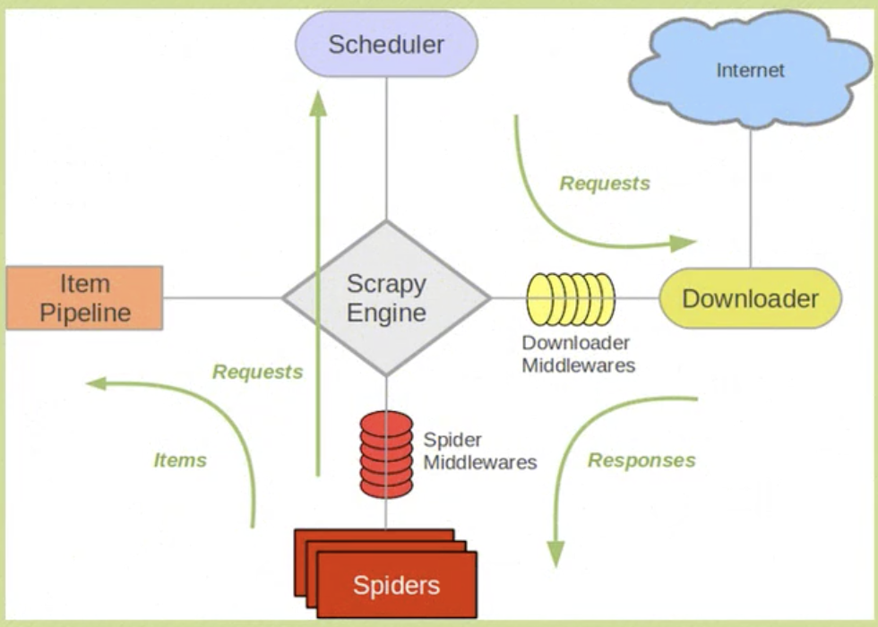

[toc]

#scrapy

Scrapy是一个为了爬取网站数据，提取结构性数据而编写的应用框架。可以应用在包括数据挖掘，信息处理或存储历史数据等一系列的程序中

安装scrapy

```python
pip install Scrapy
```

# 使用Scrapy抓取一个网站一共需要四个步骤：

* 创建一个Scrapy项目；
* 定义Item容器；
* 编写爬虫；
* 存储内容



在一个目录中启动终端输入命令

```python 
scrapy startproject projectName
# tutorial为项目名字
```

在该目录中会出现一个项目文件projectName

项目文件的结构

projectName/

​	scrapy.cfg

​	projectName/

​		_\_init\_\_.py

​		items.py

​		pipelines.py

​		settings.py

​		spiders/

​			\_\_init\_\_.py


Item是保存爬取到的数据的容器，其方法和python字典类似，并且提供了额外保护机制来避免拼写错误导致的未定义字段错误

