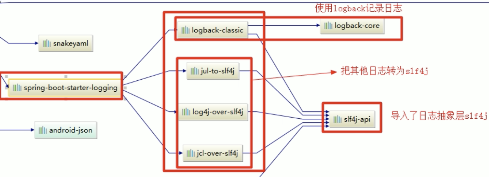

[toc]

# 一、日志框架

 1、市面上的日志框架

JUL，JCL，Jboss-logging，logback，log4j，log4j2，slf4j...

| 日志门面（日志的抽象层）                                     | 日志实现                                                     |
| ------------------------------------------------------------ | ------------------------------------------------------------ |
| ~~JCL(jakarta Commons Logging)~~（太老了）<br /> SLF4j(Simple Logging Facade for java)<br /> ~~jboss-logging~~(不适合) | Log4j <br />JUL(java.util.logging) <br />Log4j2<br />Logback |

 SLF4j、Log4j、Logback出自同一人之手，Log4j没有Logback先进，Log4j2是Apache公司做的，很不错功能很好，但是因为太好不是很好适配

左边选一个门面（抽象层）、右边来选一个实现：

日志门面：SLF4j

日志实现：Logback


SpringBoot：

​		底层是Spring框架，Spring框架默认是用JCL

​		SpringBoot将框架进行了包装，选用SLF4j和Logback来做日志

# 二、SLF4j使用

## 1、如何在系统中使用SLF4j

开发的时候，日志记录方法的调用，不应该来直接调用日志的实现类，而是调用日志抽象层里面的方法

应该给系统中导入slf4j的jar和Logback的实现jar

~~~Java
import org.slf4j.Logger;
import org.slf4j.LoggerFactory;

public class HelloWorld {
  public static void main(String[] args) {
    Logger logger = LoggerFactory.getLogger(HelloWorld.class);
    logger.info("Hello World");
  }
}
~~~


每一个日志的实现框架都有自己的配置文件，使用slf4j以后，**配置文件还是做成日志实现框架自己本身的配置文件**

## 遗留问题

a（slf4j+Logback）：Spring（Commons-logging）、Hibernate（Jboss-logging）、MyBatis、xxx


统一日志记录，即使是别的框架也和我一起统一使用slf4j进行输出：


**如何让系统中所有的日志都统一到slf4j：**

1、将系统中其他日志框架先排除出去

2、用中间包来替换原有的日志框架

3、我们导入slf4j其他的实现

# 三、SpringBoot日志关系

~~~xml
<dependency>
      <groupId>org.springframework.boot</groupId>
      <artifactId>spring-boot-starter</artifactId>
      <version>2.2.2.RELEASE</version>
      <scope>compile</scope>
   </dependency>
~~~

依赖下面这个，用它来做日志记录

```xml
<dependency>
  <groupId>org.springframework.boot</groupId>
  <artifactId>spring-boot-starter-logging</artifactId>
  <version>2.2.2.RELEASE</version>
  <scope>compile</scope>
</dependency>
```




总结：

​	1）SpringBoot底层也是使用slf4j+logback的方式进行日志记录

​	2）SpringBoot也把其他的日志都替换成了slf4j

​	3）中间替换包


​	4)如果我们要引入其他框架？一定要把这个框架的默认日志依赖移除掉，不然会出现jar包冲突；Spring框架使用的是commons-logging，SpringBoot也排除了它


SpringBoot能自动适配所有的日志，而且底层使用slf4j+Logback的方式记录日志，引入其他框架的时候，只需要把这个框架依赖的日志框架排除掉

# 四、日志的使用

| logging.file | logging.path | example  | Description                      |
| ------------ | ------------ | -------- | -------------------------------- |
| none         | none         |          | 只在控制台输出                   |
| 指定文件名   | none         | my.log   | 输出日志到my.log文件             |
| none         | 指定目录     | /var/log | 输出到指定目录的spring.log文件中 |

logging.file和logging.path是两个冲突配置，如果都指定，那只有logging.file起作用，一般的是设置logging.path（在SpringBoot2.2.2版本中修复了这个问题，弃用了logging.file只有logging.file.path）

```java
//记录器
private Logger logger = LoggerFactory.getLogger(getClass());
@Test
void contextLoads() {
    //替代 System.out.println();

    //日志的级别
    //由低到高  trace<debug<info<warn<error
    //可以调整输出到日志级别；日志就只会在这个级别以后的高级别生效
    logger.trace("这是trace日志。。。");
    logger.debug("这是debug日志。。。");
    //SpringBoot默认给我们使用的是info级别的
    //没有指定级别的就用SpringBoot默认规定的级别：root
    logger.info("这是info日志。。。");
    logger.warn("这是warn日志。。。");
    logger.error("这是error日志。。。");
}
```

## SpringBoot修改日志的默认配置

```Properties
#logging.path=
#不指定路径在当前项目下生成springboot.log日志

#可以指定完整的路径
#logging.file=G:/springboot.log

#在当前磁盘的根路径下创建Spring文件夹和里面的log文件夹,使用spring.log作为默认文件
#logging.file.path=/spring/log

#在控制台输出的日志的格式
logging.pattern.console=%d{yyyy-MM-dd} [%thread] %-5level %logger{50} -%msg%n
#指定文件中日志输出的格式
logging.pattern.file=%d{yyyy-MM-dd}===[%thread]==%-5level===%logger{50} -%msg%n
```

## 日志输出的格式

```
%d 表示日期时间，
%thread 表示线程名
%-5level 级别从左显示5个字符宽度
%logger{50} 表示logger名字最长50个字符，否则按照句点分割
%msg 日志消息
%n 换行符
```

##  指定配置

给类路径下放上每个日志框架自己的配置文件即可；SpringBoot就不适用它默认配置的

官方文档的说明：

| Logging System | Customization                                                |
| -------------- | ------------------------------------------------------------ |
| Logback        | logback-spring.xml , logback-spring.groovy , logback.xml , logback.groovy |
| Log4j2         | log4j2-spring.xml , log4j2.xml                               |
| JUL            | logging.properties                                           |

官方推荐使用带-spring扩展名的

Logback.xml:直接就被日志框架识别了

**Logback-spring.xml**:日志框架就不直接加载日志的配置项，由SpringBoot解析日志配置，可以使用SpringBoot的高级Profile功能

```xml
<springProfile name="staging">
	可以指定某段配置只在某个环境下生效
</springProfile>
```

否则报错：

```java
no applicable action for [springProfile]
```

# 五、切换日志框架

可以按照slf4j的日志适配图，进行相关的切换；

slf4j+log4j的方式，，，不推荐 

切换为log4j2的话

将Logback的starter排除

然后将log4j2的starter的依赖写入

然后将log4j2的日志格式写入