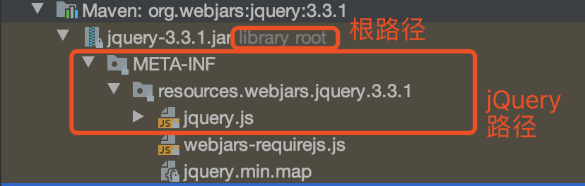
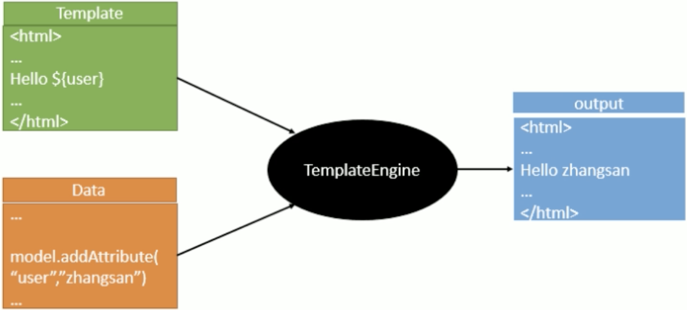
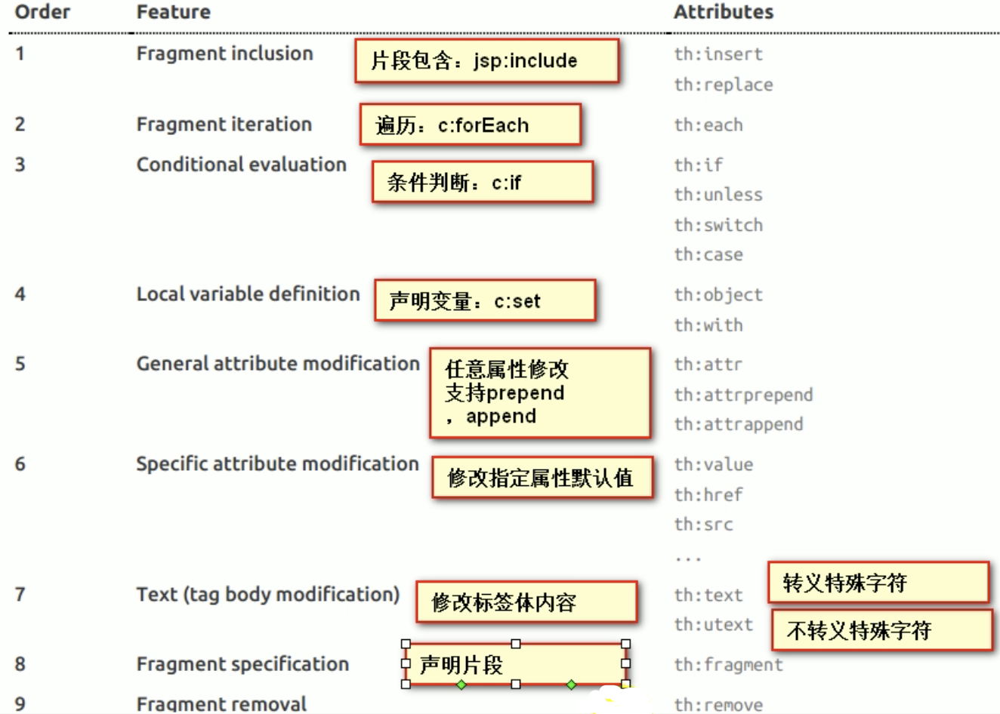
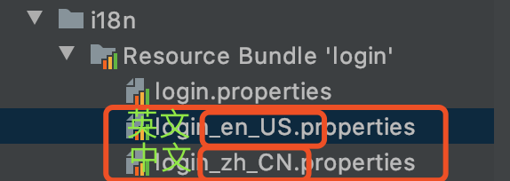

[toc]

# 一、使用SpringBoot进行web开发

使用SpringBoot

1）创建SpringBoot应用，选中我们需要的模块

2）SpringBoot已经默认将这些场景配置好了，只需要在配置文件中指定少量配置就可以运行起来

3）自己编写业务代码


自动配置原理？

这个场景SpringBoot帮我们配置了什么？能不能修改？能修改哪些配置？能不能扩展？xxx

```java
xxxAutoConfiguration：帮我们给容器中自动配置组件
xxxProperties：配置类来封装配置文件的内容
```


# 二、SpringBoot对静态资源的映射规则

```java
@ConfigurationProperties(
    prefix = "spring.resources",
    ignoreUnknownFields = false
)
public class ResourceProperties {
  //可以设置和静态资源有关的参数
```


在WebMVCAutoConfiguration.java中

addResourceHandlers(...);这个方法中写着关于静态资源映射的

```java
public void addResourceHandlers(ResourceHandlerRegistry registry) {
    if (!this.resourceProperties.isAddMappings()) {
        logger.debug("Default resource handling disabled");
    } else {
        Duration cachePeriod = this.resourceProperties.getCache().getPeriod();
        CacheControl cacheControl = this.resourceProperties.getCache().getCachecontrol().toHttpCacheControl();
        if (!registry.hasMappingForPattern("/webjars/**")) {
            this.customizeResourceHandlerRegistration(registry.addResourceHandler(new String[]{"/webjars/**"}).addResourceLocations(new String[]{"classpath:/META-INF/resources/webjars/"}).setCachePeriod(this.getSeconds(cachePeriod)).setCacheControl(cacheControl));
        }

        String staticPathPattern = this.mvcProperties.getStaticPathPattern();
        if (!registry.hasMappingForPattern(staticPathPattern)) {
            this.customizeResourceHandlerRegistration(registry.addResourceHandler(new String[]{staticPathPattern}).addResourceLocations(WebMvcAutoConfiguration.getResourceLocations(this.resourceProperties.getStaticLocations())).setCachePeriod(this.getSeconds(cachePeriod)).setCacheControl(cacheControl));
        }

    }
}

//配置欢迎页映射
@Bean
public WelcomePageHandlerMapping welcomePageHandlerMapping(ApplicationContext applicationContext, FormattingConversionService mvcConversionService, ResourceUrlProvider mvcResourceUrlProvider) {
            WelcomePageHandlerMapping welcomePageHandlerMapping = new WelcomePageHandlerMapping(new TemplateAvailabilityProviders(applicationContext), applicationContext, this.getWelcomePage(), this.mvcProperties.getStaticPathPattern());
            welcomePageHandlerMapping.setInterceptors(this.getInterceptors(mvcConversionService, mvcResourceUrlProvider));
            return welcomePageHandlerMapping;
        }
```

## 1）所有/webjars/** ,都去classpath:/META-INF/resources/webjars/里面找资源；

webjars:以jar包的方式引入静态资源(在maven中添加依赖)

添加什么依赖呢：https://www.webjars.com/



Localhost:8080/webjars/jquery/3.3.1/jquery.js

```xml
<!--引入jQuery,在访问的时候只需要写webjars下面的资源名称即可-->
<dependency>
    <groupId>org.webjars</groupId>
    <artifactId>jquery</artifactId>
    <version>3.3.1</version>
</dependency>
```

## 2）”/**“访问当前项目的任何资源（静态资源文件夹）

```
"classpath:/META-INF/resources/", 
"classpath:/resources/", 
"classpath:/static/", 
"classpath:/public/"
"/"当前项目的根路径
```

localhost:8080/js/jquery-3.3.1.js

## 3）欢迎页

静态资源文件夹下的所有index.html页面；被”/**“映射

Localhost:8080/

## 4）所有的**/xxx.xx都是在静态资源文件夹下

# 三、模板引擎

Jsp , Velocity , Freemarker , Thymeleaf



SpringBoot推荐的thymeleaf

语法简单，功能强大

## 1、引入Thymeleaf

```xml
<!--        导入模板引擎thymeleaf-->
        <dependency>
            <groupId>org.springframework.boot</groupId>
            <artifactId>spring-boot-starter-thymeleaf</artifactId>
        </dependency>
```

这里要注意的是这里面有两个东西的版本，**如果要更改版本的话**

```xml
<thymeleaf.version>3.0.11.RELEASE</thymeleaf.version>
//这里的版本号是对应的，在GitHub里面就有说明，thymeleaf3版本对应thymeleaf-layout2版本，不要踩坑
<thymeleaf-layout-dialect.version>2.4.1</thymeleaf-layout-dialect.version>
```

## 2、thymeleaf的使用&语法

```java
@ConfigurationProperties(
    prefix = "spring.thymeleaf"
)
public class ThymeleafProperties {
    public static final String DEFAULT_PREFIX = "classpath:/templates/";
    public static final String DEFAULT_SUFFIX = ".html";

```

只要我们把HTML页面放在classpath:/templates/,thymeleaf就能自动渲染了

### 1）导入thymeleaf的名称空间

```html
<html lang="en" xmlns:th="http://www.thymeleaf.org">
```

### 2）使用thymeleaf语法


### 3）语法规则

* th:text;改变当前元素里面的文本内容

  * th:text可以用[[]]来替代
  * th:utext可以用[()]来替代

  th:任意HTML属性；来替换原生属性的值



* 表达式

  ~~~Properties
  Simple expressions:（表达式语法）
    Variable Expressions: ${...}；获取变量值；OGNL
    		1）获取对象的属性，调用方法
    		2）使用内置的基本对象：
    					#ctx : the context object.
              #vars: the context variables.
              #locale : the context locale.
              #request : (only in Web Contexts) the HttpServletRequest object.
              #response : (only in Web Contexts) the HttpServletResponse object.
              #session : (only in Web Contexts) the HttpSession object.
              #servletContext : (only in Web Contexts) the ServletContext object
        3）内置的一些工具对象
              #execInfo : information about the template being processed.
              #messages : methods for obtaining externalized messages inside variables expressions, in the same way as they would be obtained using #{…} syntax.
              #uris : methods for escaping parts of URLs/URIs
              #conversions : methods for executing the configured conversion service (if any).
              #dates : methods for java.util.Date objects: formatting, component extraction, etc.
              #calendars : analogous to #dates , but for java.util.Calendar objects.
              #numbers : methods for formatting numeric objects.
              #strings : methods for String objects: contains, startsWith, prepending/appending, etc.
              #objects : methods for objects in general.
              #bools : methods for boolean evaluation.
              #arrays : methods for arrays.
              #lists : methods for lists.
              #sets : methods for sets.
              #maps : methods for maps.
              #aggregates : methods for creating aggregates on arrays or collections.
              #ids : methods for dealing with id attributes that might be repeated (for example, as a result of an iteration).
              
    Selection Variable Expressions: *{...}：选择表达式：和${}的功能一样，补充配合th:object
    例子：
    	<div th:object="${session.user}">
        <p>Name: <span th:text="*{firstName}">Sebastian</span>.</p>
        <p>Surname: <span th:text="*{lastName}">Pepper</span>.</p>
        <p>Natio
  		</div>
    
    Message Expressions: #{...}：获取国际化内容
    Link URL Expressions: @{...}：定义URL；
    例子：
      @{/order/process(execId=${execId},execType='FAST')}
    
    Fragment Expressions: ~{...}：片段引用格式
    例子：
    	<div th:insert="~{commons :: main}">...</div>
    	
  Literals（字面量）
      Text literals: 'one text' , 'Another one!' ,…
      Number literals: 0 , 34 , 3.0 , 12.3 ,…
      Boolean literals: true , false
      Null literal: null
      Literal tokens: one , sometext , main ,…
  Text operations:（文本操作）
      String concatenation: +
      Literal substitutions: |The name is ${name}|
  Arithmetic operations:（数学运算）
      Binary operators: + , - , * , / , %
      Minus sign (unary operator): -
  Boolean operations:（布尔运算）
      Binary operators: and , or
      Boolean negation (unary operator): ! , not
  Comparisons and equality:（比较运算）
      Comparators: > , < , >= , <= ( gt , lt , ge , le )
      Equality operators: == , != ( eq , ne )
  Conditional operators:（条件操作）
      If-then: (if) ? (then)
      If-then-else: (if) ? (then) : (else)
      Default: (value) ?: (defaultvalue)
  Special tokens:（特殊指令）
  		No-Operation: _
  ~~~

# 四、SpringMVC自动配置

## 1、SpringMVC auto-configuration

Spring Boot 自动配置好了SpringMVC

以下是SpringBoot对SpringMVC的默认配置：

- Inclusion of **ContentNegotiatingViewResolver** and **BeanNameViewResolver** beans.

  - 自动配置了ViewResolver（视图解析器：根据方法的返回值得到视图对象（view），视图对象决定如何渲染（转发？重定向））
  - ContentNegotiatingViewResolver:组合所有的视图解析器；
  - ==如何定制：我们可以自己给容器中添加一个视图解析器；自动将其组合进来==

- Support for serving static resources, including support for **WebJars** (covered later in this

  document)).静态资源文件夹路径webjars

- Automatic registration of **Converter**, **GenericConverter**, and **Formatter** beans.自动注册

  - Converter：转换器；类型转换使用converter
  - Formatter：格式化器；2017-12-17===》Date,
    - 可以自己添加格式化转换器，我们只需要放在容器中即可

- Support for **HttpMessageConverters** (covered later in this document).

  - HttpMessageConverter:SpringMVC用来转换Http请求和相应的；User---json
  - HttpMessageConverter是从容器中确定的；获取所有的HttpMessageConverter
  - ==自己给容器中添加HttpMessageConverter，只需要将自己的组件注册容器中（@Bean，@Component）==

- Automatic registration of MessageCodesResolver (covered later in this document).

  - 定义错误代码生成规则

- Static index.html support.静态首页访问

- Custom Favicon support (covered later in this document).favicon.ico

- Automatic use of a **ConfigurableWebBindingInitializer** bean (covered later in this document).

  - 我们可以配置一个ConfigurableWebBindingInitializer来替换默认的；（添加到容器）
  - 初始化WebDataBinder;请求数据===JavaBean

  

  **org.springframework.boot.autoconfigure.web**：web所有自动场景

  If you want to keep Spring Boot MVC features and you want to add additional MVC configuration (interceptors, formatters, view controllers, and other features), you can add your own @Configuration class of type WebMvcConfigurer but **without** @EnableWebMvc. If you wish to provide custom instances of RequestMappingHandlerMapping, RequestMappingHandlerAdapter, or ExceptionHandlerExceptionResolver, you can declare a WebMvcRegistrationsAdapter instance to provide such components. If you want to take complete control of Spring MVC, you can add your own @Configuration annotated with @EnableWebMvc.


## 2、扩展SpringMVC

==编写一个配置类（@Configuration），是WebMvcConfigurer类型的；不能标注@EnableWebMvc==

既保留了所有的自动配置，也能用我们扩展的配置

```java
//实现WebMvcConfigurer接口（有默认方法所以不实现里面的方法也不会报错），可以扩展SpringMVC的功能
@Configuration
public class MyMvcConfig implements WebMvcConfigurer {
    @Override
    public void addViewControllers(ViewControllerRegistry registry) {
      //浏览器发送/welcome请求来到success
        registry.addViewController("/welcome").setViewName("success");
    }
}
```

原理：

* WebMvcAutoConfiguration是SpringMVC的自动配置类
* 在做其他自动配置时会导入；@Import(EnableWebMvcConfiguration.class)

```java
@Configuration(proxyBeanMethods = false)
public static class EnableWebMvcConfiguration extends DelegatingWebMvcConfiguration implements ResourceLoaderAware {
  	private final WebMvcConfigurerComposite configurers = new WebMvcConfigurerComposite();

  //从容器中获取所有的WebMvcConfigurer
  @Autowired(required = false)
	public void setConfigurers(List<WebMvcConfigurer> configurers) {
		if (!CollectionUtils.isEmpty(configurers)) {
			this.configurers.addWebMvcConfigurers(configurers);
		}
	}
  /*
  在addWebMvcConfigurations中，将所有的WebMvcConfigurer相关配置都来一起调用
  public void addWebMvcConfigurers(List<WebMvcConfigurer> configurers) {
		if (!CollectionUtils.isEmpty(configurers)) {
			this.delegates.addAll(configurers);
		}
	}
	*/
```

* 容器中所有的WebMvcConfigurer都会一起起作用
* 我们的配置类也会被调用
  * 效果：SpringMVC和自己扩展的配置都会起作用

## 3、全面接管SpringMVC

SpringBoot对SpringMVC对自动配置不需要了，所有都是我们自己配；**所有的SpringMVC自动配置都失效**

我们需要在配置类中添加@EnableWebMvc即可

原理：

为什么加了@EnableWebMvc自动配置就失效了

* @EnableWebMvc的核心

  ```java
  @Retention(RetentionPolicy.RUNTIME)
  @Target(ElementType.TYPE)
  @Documented
  @Import(DelegatingWebMvcConfiguration.class)
  public @interface EnableWebMvc {
  }
  ```

* ```java
  @Configuration(proxyBeanMethods = false)
  public class DelegatingWebMvcConfiguration extends WebMvcConfigurationSupport {
  ```

* ```java
  @Configuration(proxyBeanMethods = false)
  @ConditionalOnWebApplication(type = Type.SERVLET)
  @ConditionalOnClass({ Servlet.class, DispatcherServlet.class, WebMvcConfigurer.class })
  //容器中没有这个组件的时候，这个自动配置类才生效
  @ConditionalOnMissingBean(WebMvcConfigurationSupport.class)
  @AutoConfigureOrder(Ordered.HIGHEST_PRECEDENCE + 10)
  @AutoConfigureAfter({ DispatcherServletAutoConfiguration.class, TaskExecutionAutoConfiguration.class,
        ValidationAutoConfiguration.class })
  public class WebMvcAutoConfiguration {
  ```

* @EnableWebMvc将WebMvcConfigurationSupport组件导入进来了
* 导入的WebMvcConfigurationSupport只是SpringMVC最基本的功能


# 五、如何修改SpringBoot的默认配置

模式：

* SpringBoot在自动配置很多组件的时候，先看容器中有没有用户自己配置的（@Bean，@Component）如果有就用用户配置的，如果没有，才自动配置；如果有些组件可以有多个（ViewResolver）将用户配置的和自己默认配置的组合起来

* 中SpringBoot中会有非常多的xxxCOnfigure帮助我们进行扩展配置

# 六、RestfulCRUD

## 1、默认访问首页，引入静态资源


## 2、国际化

Springmvc的话

1）编写国际化配置文件

2）使用ResourceBundleMessageSource管理国际化文件

3）在页面使用fmt:message取出国际化内容

SpringBoot:

1)编写国际化配置文件，抽取页面需要显示的国际化消息



2）SpringBoot自动配置好了管理国际化资源文件的组件

```java
@EnableConfigurationProperties
public class MessageSourceAutoConfiguration {

   private static final Resource[] NO_RESOURCES = {};

   @Bean
   @ConfigurationProperties(prefix = "spring.messages")
   public MessageSourceProperties messageSourceProperties() {
      return new MessageSourceProperties();
   }
  
  
  //在MessageSourceProperties中
  /**
	 * Comma-separated list of basenames (essentially a fully-qualified classpath
	 * location), each following the ResourceBundle convention with relaxed support for
	 * slash based locations. If it doesn't contain a package qualifier (such as
	 * "org.mypackage"), it will be resolved from the classpath root.
	 */
  //我们的配置文件可以直接放在类路径下叫messages.properties
	private String basename = "messages";
  
  @Bean
	public MessageSource messageSource(MessageSourceProperties properties) {
		ResourceBundleMessageSource messageSource = new ResourceBundleMessageSource();
		if (StringUtils.hasText(properties.getBasename())) {
      //设置国际化资源文件的基础名（去掉语言国家代码）
      //如login_zh_CN.properties-->package.login
			messageSource.setBasenames(StringUtils
					.commaDelimitedListToStringArray(StringUtils.trimAllWhitespace(properties.getBasename())));
		}
		if (properties.getEncoding() != null) {
			messageSource.setDefaultEncoding(properties.getEncoding().name());
		}
		messageSource.setFallbackToSystemLocale(properties.isFallbackToSystemLocale());
		Duration cacheDuration = properties.getCacheDuration();
		if (cacheDuration != null) {
			messageSource.setCacheMillis(cacheDuration.toMillis());
		}
		messageSource.setAlwaysUseMessageFormat(properties.isAlwaysUseMessageFormat());
		messageSource.setUseCodeAsDefaultMessage(properties.isUseCodeAsDefaultMessage());
		return messageSource;
	}
```

前端代码写为

```html
<!DOCTYPE html>
<html lang="en" xmlns:th="http://www.thymeleaf.org">
<head>
    <meta http-equiv="Content-Type" content="text/html; charset=UTF-8" />
    <meta name="viewport" content="width=device-width, initial-scale=1, shrink-to-fit=no" />
    <meta name="description" content="" />
    <meta name="author" content="" />
    <title>登录页面</title>

    <!-- Bootstrap core CSS -->
    <link href="#" th:href="@{/webjars/bootstrap/3.3.7-1/css/bootstrap.css}" rel="stylesheet" />

    <!-- Custom styles for this template -->
    <link href="/css/signin.css" th:href="@{/css/signin.css}" rel="stylesheet" />
  </head>

  <body class="text-center" th:inline="text">
    <form class="form-signin" th:action="@{/user/login}" method="post">
      
      <h1 class="h3 mb-3 font-weight-normal" >[[#{login.tip}]]</h1>
        <!--判断-->
        <p style="color: red" th:text="${msg}" th:if="${not #strings.isEmpty(msg)}"></p>
      <!--注意下面国际化的使用方法#{}-->
      <label  class="sr-only" th:text="#{login.username}">Username</label>
      <input type="text"  name="username" class="form-control" placeholder="Username" th:placeholder="#{login.username}" required="" autofocus=""/>
      <label for="inputPassword" class="sr-only" th:text="#{login.password}">Password</label>
      <input type="password" name="password" id="inputPassword" class="form-control" placeholder="Password" th:placeholder="#{login.password}" required="" />
      <div class="checkbox mb-3">
        <label >
          <input type="checkbox" value="remember-me" /> [[#{login.remember}]]
        </label>
      </div>
      <button class="btn btn-lg btn-primary btn-block" type="submit" th:text="#{login.btn}">Sign in</button>
      <p class="mt-5 mb-3 text-muted">© 2017-2018</p>
        <a href="#" class="btn btn-sm" >中文</a>
        <a href="#" class="btn btn-sm" >English</a>
    </form></body></html>
```

效果：根据浏览器语言设置的信息切换了国际化


原理：

​	国际化Locale（区域信息对象）；localeResolver（获取区域信息对象）

默认的就是根据请求头带来的区域信息获取Locale进行国际化

4）点击链接切换国际化

```java
package com.mofeng.restfulcrud.component;

/**实现LocaleResolver
 * 可以在链接上切换国际化
 */

public class MyLocaleResolver implements LocaleResolver {
    @Override
    public Locale resolveLocale(HttpServletRequest request) {
        String l = request.getParameter("l");
        Locale locale = Locale.getDefault();
        if (!StringUtils.isEmpty(l)){
            String [] split = l.split("_");
            locale = new Locale(split[0],split[1]);
        }
        return locale;
    }

    @Override
    public void setLocale(HttpServletRequest request, HttpServletResponse response, Locale locale) {

    }
}

//然后加入容器中（在@Configuration中添加）
  @Bean
    public LocaleResolver localeResolver(){
        return new MyLocaleResolver();
    }
```

## 3、登录

开发期间模板引擎页面修改以后，要实时生效

* 禁用模板引擎的缓存

```properties
#禁用模板引擎的缓存
spring.thymeleaf.cache=false
```

* 页面修改完成以后ctrl+f9重新编译


登录错误的提示

```html
<p style="color: red" th:text="${msg}" th:if="${not #strings.isEmpty(msg)}"></p>
```

* 为了防止重复提交表单，对**登陆的表单请求做重定向**

  在controller中定义响应的登录方法

```java
@PostMapping(value = "/user/login")
public String login(@RequestParam("username") String username,
                    @RequestParam("password") String password,
                    Map<String,Object> map, HttpSession session
                    ){
    if (!StringUtils.isEmpty(username)&&"123456".equals(password)){
        session.setAttribute("loginUser",username);
      //重定向的写法！！
        return "redirect:/welcome.html";
    }else {
        map.put("msg","用户名密码错误!");
        return "login";
    }
}

```

​	在自定义配置中添加一个路径映射

```java
@Override
public void addViewControllers(ViewControllerRegistry registry) {
    registry.addViewController("/index.html").setViewName("login");
 //在此添加重定向的路径
 registry.addViewController("/welcome.html").setViewName("dashboard");
}
```

​	成功登录以后的效果是：浏览器的地址为：http://127.0.0.1:8080/**welcome.html**

## 4、拦截器进行登录检查

（为防止有人未经登录就访问之后的页面）

1、编写一个HandlerInterceptor的实现类

```Java
public class LoginHandleInterceptor implements HandlerInterceptor {
    //目标方法执行之前
    @Override
    public boolean preHandle(HttpServletRequest request, HttpServletResponse response, Object handler) throws Exception {
        Object user = request.getSession().getAttribute("loginUser");
        if (user==null){
            //未登录,返回登录页面
            request.setAttribute("msg","没有权限,请先登录");
            //请求转发
            request.getRequestDispatcher("/index.html").forward(request,response);

            return false;

        }else {
            //已登录,放行请求
            return true;
        }
    }
}
```

2、在配置类中去注册那个组件（实现类）

```java

@Configuration
public class MyMvcConfig implements WebMvcConfigurer {
  
/**
 * 静态资源如**.css **.js等SpringBoot已经做好静态资源映射,不需要做额外操作
 * @param registry
 */
@Override
public void addInterceptors(InterceptorRegistry registry) {
    registry.addInterceptor(new LoginHandleInterceptor()).addPathPatterns("/**")
      //需要排除一些登录所需的路径
            .excludePathPatterns("/index.html","/","/user/login");
}
```

## 5、CRUD-员工列表

要求：

* RestfulCRUD：CRUD要满足Rest风格
  * URI：/资源名称/资源标识     HTTP请求方式区分对资源CRUD操作

|      | 普通CRUD（uri来区分操作） | RestfulCRUD       |
| ---- | ------------------------- | ----------------- |
| 查询 | getEmp                    | emp---GET         |
| 添加 | addEmp？xx                | emp---POST        |
| 修改 | updateEmp？id=xxxx&xxx=xx | emp/{id}---PUT    |
| 删除 | deleteEmp？id=1           | emp/{id}---DELETE |

* 实验的请求架构：

|                                    | 请求URI  | 请求方式 |
| ---------------------------------- | -------- | -------- |
| 查询所有员工                       | emps     | GET      |
| 查询某个员工                       | emp/{id} | GET      |
| 来到添加页面                       | emp      | GET      |
| 添加员工                           | emp      | POST     |
| 来到修改页面(查出员工进行信息回显) | emp/{id} | GET      |
| 修改员工                           | emp      | PUT      |
| 删除员工                           | emp/{id} | DELETE   |

* 员工列表

```html
<li class="nav-item">
    <a class="nav-link"
       th:class="${activeUri}=='emps'?'nav-link active':'nav-link'"
       href="https://getbootstrap.com/docs/4.1/examples/dashboard/#" th:href="@{/emps}">*******这里写访问的URI
        <svg xmlns="http://www.w3.org/2000/svg" width="24" height="24" viewBox="0 0 24 24" fill="none" stroke="currentColor" stroke-width="2" stroke-linecap="round" stroke-linejoin="round" class="feather feather-users"><path d="M17 21v-2a4 4 0 0 0-4-4H5a4 4 0 0 0-4 4v2"></path><circle cx="9" cy="7" r="4"></circle><path d="M23 21v-2a4 4 0 0 0-3-3.87"></path><path d="M16 3.13a4 4 0 0 1 0 7.75"></path></svg>
        员工管理
    </a>
</li>
```

在controller中

```java
@Controller
public class EmployeeController {
    @Autowired
    EmployeeDao employeeDao;
    @GetMapping("/emps")
    public String list(Model model){
        Collection<Employee> all = employeeDao.getAll();
      //将得出的集合放入请求域中，由前端渲染
        model.addAttribute("emps",all);
        return "emp/list";
    }
}
```

## thymeleaf公共页面元素抽取

```html
1、抽取公共片段
<div th:fragment="copy">
  &copy;2011 The Good Thymes Virtual Grocery
</div>
2、引入公共片段
<div th:insert="~{footer::copy}"></div>
~{templatename::selector};模板名：：选择器
~{templatename::fragmentname};模板名：：片段名
3、默认效果：
insert的功能片段在div标签中
如果使用th:insert等属性进行引入，可以不用写~{};
行内写法可以加上[[~{}]];[(~{})];

```


三种引入功能片段的th属性：

* th:insert：将公共片段整个插入到声明引入的元素中
* th:replace：将声明引入的元素替换为公共片段
* th:include：将被引入的片段的内容包含进这个标签中

```html
<footer th:fragment="copy">
  &copy;2011 The Good Thymes Virtual Grocery
</footer>
引入方式
<div th:insert="footer::copy"></div>
<div th:replace="footer::copy"></div>
<div th:include="footer::copy"></div>

效果：
insert：
<div>
  <footer>
   &copy;2011 The Good Thymes Virtual Grocery
  </footer>
</div>
replace：
<footer>
   &copy;2011 The Good Thymes Virtual Grocery
</footer>
include：
<div>
   &copy;2011 The Good Thymes Virtual Grocery
</div>
```

