[toc]

# 机器学习基础

## 机器学习概念

​    机器学习能够从无序的数据中提取出有用的信息,那么什么是机器学习呢?以垃圾邮件的检测为例,垃圾邮件的检测是指 能够对邮件做出判断,判断其为垃圾邮件还是正常邮件.

​    机器学习是从数据中学习和提取有用的信息，不断提升机器的性能。那么，对于一个具体的机器学习的问题，很重要的一部分是对数据的收集，我们称这部分数据为训练数据。机器学习的基本工作是从这些数据中学习规则，利用学习到的规则来预 测新的数据。 

## 机器学习算法的分类

在机器学习中，根据任务的不同，可以分为监督学习（Supervised Learning）、无监督学习（Unsupervised Learning）、半监督学习（Semi-Supervised Learning）和增强学习（Reinforcement Learning）。 

* 监督学习（Supervised Learning）的训练数据包含了类别信息，如在垃圾邮件检测中，其训练样本包含了邮件的类别信息：垃圾邮件和非垃圾邮件。在监督学习中，典型的问题是分类（Classification）和回归（Regression），典型的算法有Logistic Regression、BP神经网络算法和线性回归算法。 
* 无监督学习（Unsupervised Learning）训练数据中不包含任何类别信息。在无监督学习中，其典型 的问题为聚类（Clustering）问题，代表算法有K-Means算法、DBSCAN算法等。
* 半监督学习（Semi-Supervised Learning）的训练数据中有一部分数据包含类别信息，同时有一部分数据不包含类别信息，是监督学习和无监督学习的融合。在半监督学习中，其算法一般是在监督学习的算法上进行扩展，使之可以对未标注数据建模。

监督学习和无监督学习是使用较多的两种学习方法，而半监督学习是监督学习和无监督学习的融合

## 监督学习

### 监督学习重点

在监督学习中，其训练样本中同时包含有特征和标签信息。在监督学习中，分类（Classification）算法和回归（Regression）算法是两类最重要的算法，两者之间最主要的区别是分类算法中的标签是离散的值，如广告点击问题中的标签为{+1，-1}，分别表示广告的点击和未点击，而回归算法中的标签值是连续的值，如通过人的身高、性别、体重等信息预测人的年龄，因为年龄是连续的正整数，因此标签为y∈N+ ，且y∈[1，80]。 

### 监督学习的流程

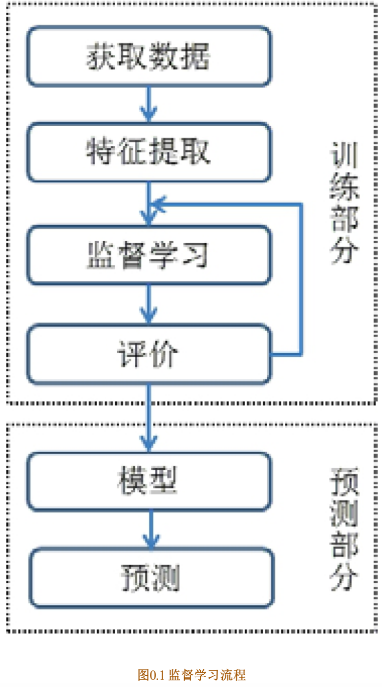

1. 获取到带有属性值的样本
2. 对样本进行预处理，过滤数据中的杂质，保留其中有用的信息（特征提取或特征处理）
3. 通过监督学习算法习得样本特征到样本标签之间的假设函数
4. 通过假设函数对新的数据进行预测

### 监督学习算法

#### 分类问题（Classification）

通过训练数据学习一个从观测样本到离散的标签的映射，分类问题是一个监督学习问题。典 

型的问题有：①垃圾邮件的分类（Spam Classification）②点击 

率预测（Click-through Rate Prediction）；③手写字 

识别

#### 回归问题（Regression）

通过训练数据学习一个从观测样本到连续的标签的映射，在回归问题中 

的标签是一系列连续的值。典型的回归问题有：①股票价格的预测②房屋价格的预测

## 无监督学习

### 概念

无监督学习（Unsupervised Learning）是另一种机器学习算法，与监督学习不同的是，在无监督学习中，其样本中只含有特征，不包含标签信息。与监督学习（Supervised Learning）不同的是，由于无监督学习不包含标签信息，在学习时并不知道其分类结果是否正确。 

### 无监督学习的流程

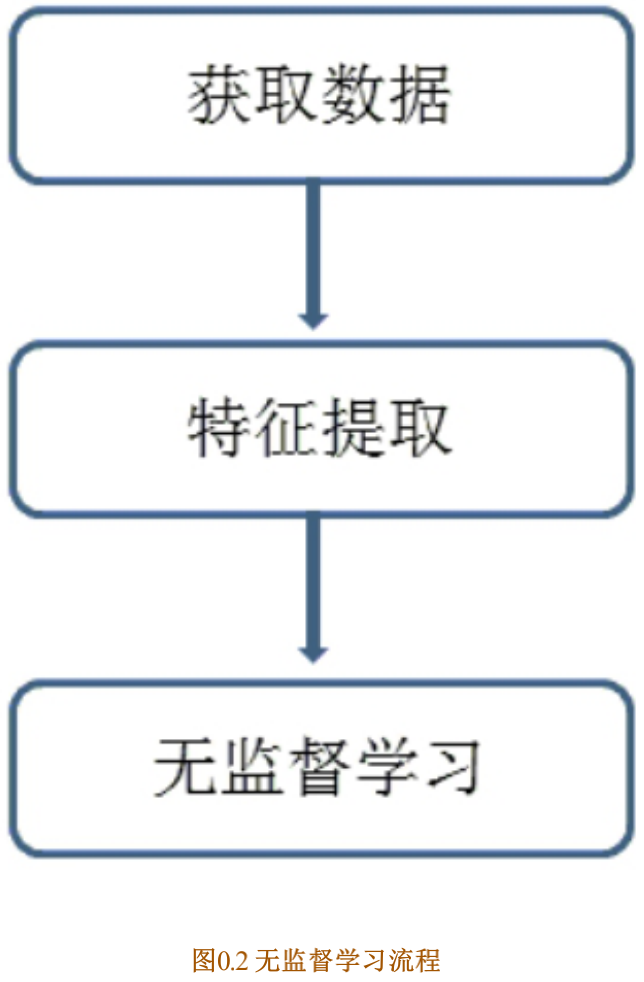

1. 获取到带有特征值的样本
2. 对样本进行处理，得到样本中有用的信息（特征处理，特征提取）
3. 通过无监督学习算法处理这些样本，如利用聚类算法对这些样本进行聚类

### 无监督学习算法

#### 聚类算法

聚类算法是无监督学习算法中最典型的一种学习算法。聚类算法利用样本的特征，将具有相似特征的样本划分到同一个类别中，而不关心这个类别具体是什么。

## 推荐系统和深度学习

在机器学习算法中，除了按照上述的分类将算法分成监督学习和无监督学习外，还有其他的一些分类方法，如按照算法的功能，将算法分成分类算法、回归算法、聚类算法和降维算法等。随着机器学习领域的不断发展，出现了很多新的研究方向，推荐算法和深度学习是近年来研究较多的方向。

### 推荐系统的意义

随着信息量的急剧扩大，信息过载的问题变得尤为突出，当用户无明确的信息需求时，用户无法从大量的信息中获取到感 兴趣的信息，同时，信息量的急剧上升也导致了大量的信息被埋没，无法触达一些潜在用户。推荐系统（Recommendation System，RS）的出现被称为连接用户与信息的桥梁，一方面帮助用户从海量数据中找到感兴趣的信息，另一方面将有价值的信 息传递给潜在用户。 

在推荐系统中，推荐算法起着重要的作用，常用的推荐算法主要有：协同过滤算法、基于矩阵分解的推荐算法和基于图的推荐算法。 

### 深度学习由来

传统的机器学习算法都是利用浅层的结构，这些结构一般包含最多一到两层的非线性特征变换，浅层结构在解决很多简单的问题上效果较为明显，但是在处理一些更加复杂的与自然信号的问题时，就会遇到很多问题。

随着计算机的不断发展，人们尝试使用深层的结构来处理这些更加复杂的问题，但是，同样也遇到了很多的困难，直到2006年，Hinton等人提出了逐层训练的概念，深度学习又一次进入了人们的视野，数据量的不断扩大以及计算机计算能力的增强，使得深度学习技术成为可能。在深度学习中，常用的几种模型包括：①自编码器模型②卷积神经网络模型③循环神经网络

## python在机器学习中的优势

* 在机器学习算法中，涉及大量的与线性代数相关的知识，Python中有Numpy函数库可以专门用于处理各种线性代数的问题
* Python社区有庞大的库，几乎可以解决大部分问题；
* Python被称为胶水语言，可以以混合编译的方式使用C/C++/Java等语言的库；
* Python语法简单，同时易于操作。

# 第一部分 分类算法

# Logistic Regression（逻辑回归）

分类算法是典型的监督学习，分类算法通过对训练样本的学习，得到从样本特征到样本的标签之间的映射关系，也被称为假设函数，之后可利用该假设函数对新数据进行分类。

通过训练数据中的正负样本，学习样本特征到样本标签之间的假设函数，Logistic Regression算法是典型的线性分类器，有算法复杂度低、容易实现等特点。

## Logistic Regression模型

### 线性可分和线性不可分

对于一个分类问题，通常可以分为线性可分与线性不可分两种。如果一个分类问题可以使用线性判别函数正确分类，则称该问题为线性可分否则为线性不可分问题

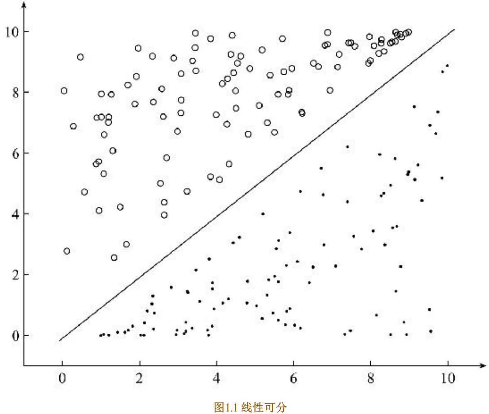

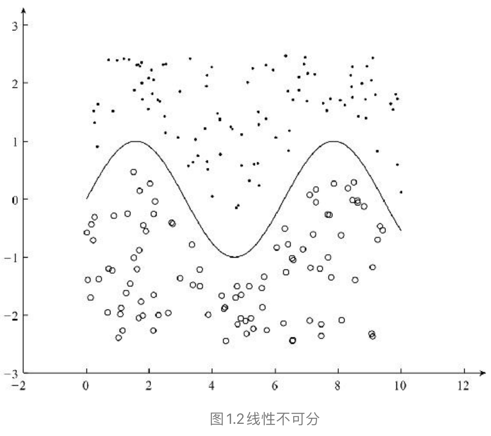

### Logistic Regression模型

对于图1.1 所示的线性可分的问题，需要找到一条直线，能够将两个不同的类区分开，这条直线也称为超平面。 在**Logistic Regression算法中，通过对训练样本的学习，最终得到该超平面**，将数据分成正负两个类别如图1.1所示，

对于上述的超平面，可以使用如下的线性函数表示：
$$
Wx+b=0
$$
（W为权重，b为偏置，若在多维的情况下，权重W 和偏置b均为向量）

可以使用阈值函数，将样本映射到不同的类别中，常见的阈值函数有Sigmoid函数，其形式如下所示：
$$
f(x)=\frac{1}{1+e^{-x}}
$$
Sigmoid函数的图像

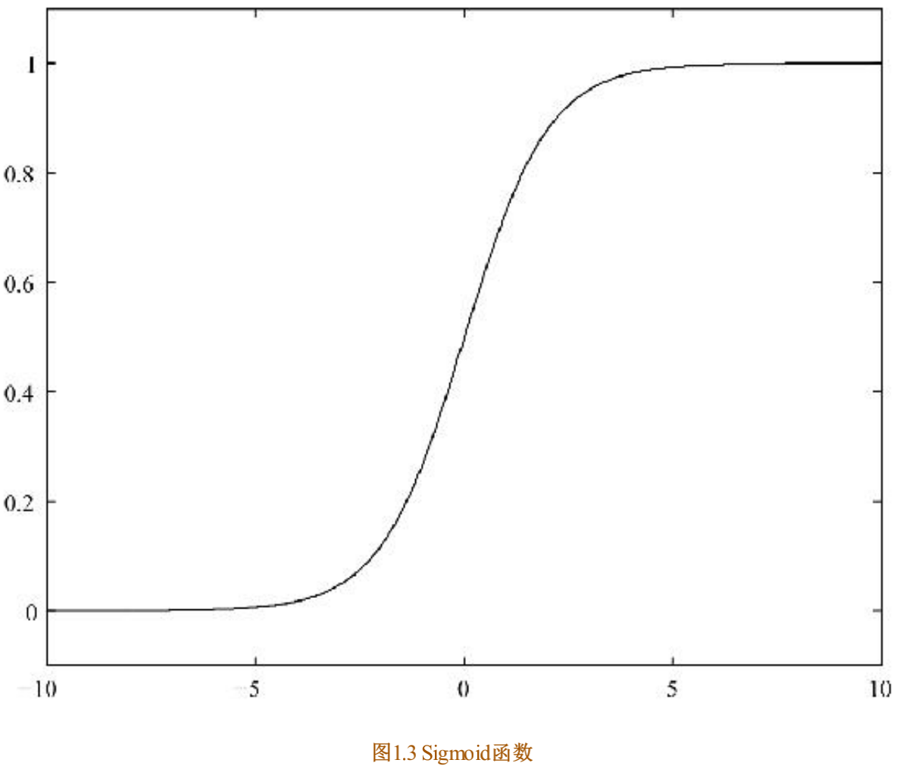

从Sigmoid函数的图像可以看出，其函数的值域为（0，1），在0附近的变化比较明显。其导函数 f′（x）为：

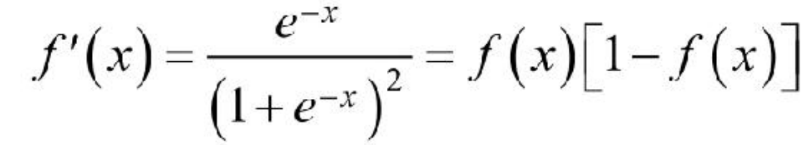

#### Python实现Sigmoid函数

```python
import numpy as np
def sig(x):
  '''Sigmoid函数
  input: x(mat):feature*W
  output: sigmoid(x)(mat):Sigmoid值
  '''
  return 1.0/(1+np.exp(-x))
```

Sigmoid函数的输出为sigmoid值，对于输入向量X，其属于正例的概率为：

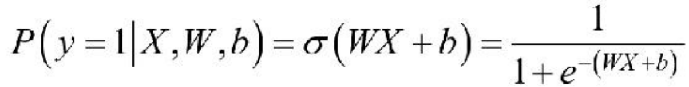

*σ* 表示的是Sigmoid函数。那么，对于输入向量X，其属于负例的概率为：

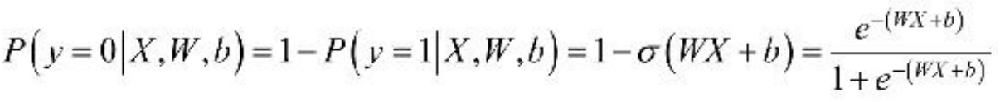

对于Logistic Regression算法来说，需要求解的分隔超平面中的参数，即为权重矩阵W 和偏置向量b，那么，这些参数该如何求解呢？为了求解模型的两个参数，首先必须定义损失函数。 

### 损失函数

对于上述的Logistic Regression算法，其属于类别y的概率为：


要求上述问题中的参数W 和b，可以使用极大似然法对其进行估计。假设训练数据集有m个训练样本{（X（1），y（1）），（X（2），y（2）），…，（X（m） ，y（m））}，则其似然函数为：

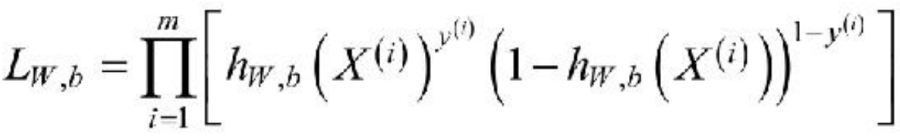

其中，假设函数为：

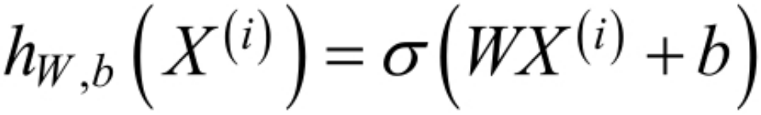

对于似然函数的极大值的求解，通常使用Log似然函数，在Logistic Regression算法中，通常是将负的Log似然函数作为其损失函数，即the negativelog-likelihood （NLL）作为其损失函数，此时，需要计算的是NLL的极小值。损失函数lW，b 为：

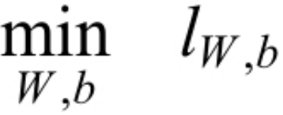

为了求得损失函数lW，b 的最小值，可以使用基于梯度的方法进行求解。

## 梯度下降法

在机器学习算法中，对于很多监督学习模型，需要对原始的模型构建损失函数l，接下来便是通过优化算法对损失函数l进行优化，以便寻找到最优的参数W。在求解机器学习参数W 的优化算法时，使用较多的是基于梯度下降的优化算法（Gradient Descent，GD）。 

优点：求解过程中只需求解损失函数的一阶导数，计算成本较小，能在很多大规模数据集上得到应用

含义：通过当前点的梯度方向寻找到新的迭代点，并从当前点移动到新的迭代点继续寻找新的迭代点，直到找到最优解。 

### 梯度下降法的流程

根据初始点在每一次迭代的过程中选择下降法方向，进而改变需要修改的参数，对于优化问题min f（w），梯度下降法的详细过程如下所示。 

* 随机选择一个初始点W<sub>0</sub>
* 重复以下过程

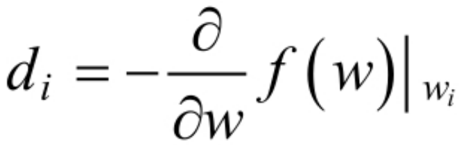

* 决定梯度下降的方向
* 选择步长a
* 更新：W<sub>i+1</sub>=W<sub>i</sub>+a·d<sub>i</sub>
* 直到满足终止条件

具体过程如图1.4所示

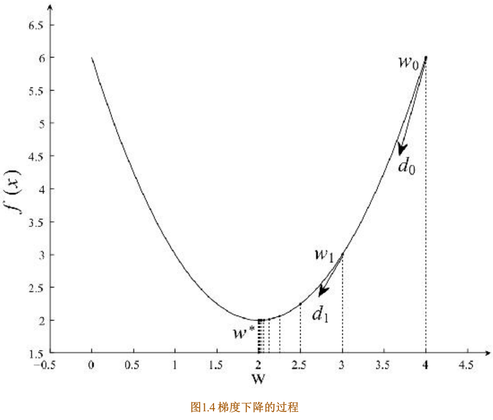

在初始时，在点w<sub>0</sub> 处，选择下降的方向d<sub>0 </sub>，选择步长*α* ，更新w的值，此时到达w<sub>1</sub> 处，判断是否满足终止的条件，发现并未到达最优解w<sup>∗</sup> ，重复上述的过程，直至到达w<sup>∗</sup>。

### 凸优化与非凸优化

凸优化问题是指只存在一个最优解的优化问题，即任何一个局部最优解即全局最优解，如图1.5所示。

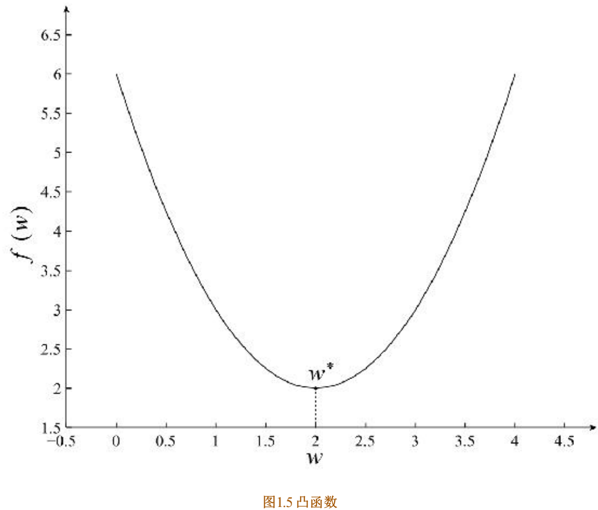

非凸优化是指在解空间中存在多个局部最优解，而全局最优解是其中的某一个局部最优解，如图1.6所示。

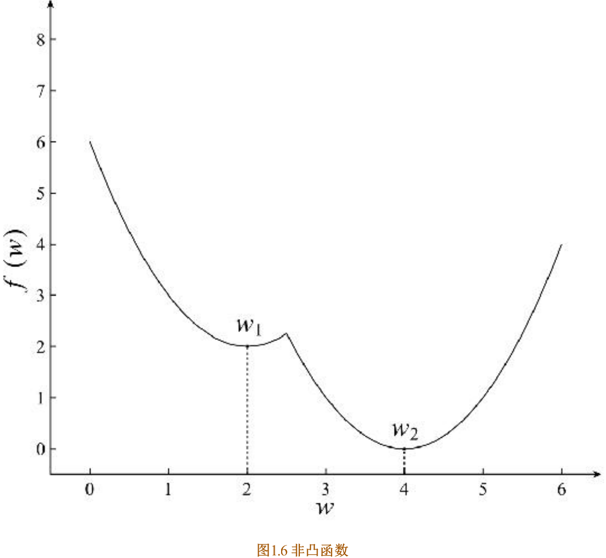

最小二乘（Least Squares）、岭回归（Ridge Regression）和Logistic回归（Logistic Regression）的损失函数都是凸优化问题。 

### 利用梯度下降法训练Logistic Regression模型

对于上述的Logistic Regression算法的损失函数可以通过梯度下降法对其进行求解，其梯度为：


其中，x<sup>(i)</sup><sub>j</sub>表示的是样本X<sup>(i)</sup>的第j个分量，取w<sub>0</sub>=b，且将偏置项的变量x<sub>0</sub>设置为1，则可以将上述的梯度合并为：

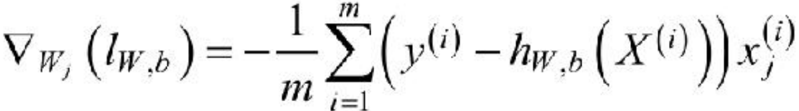

根据梯度下降法，得到如下更新公式：

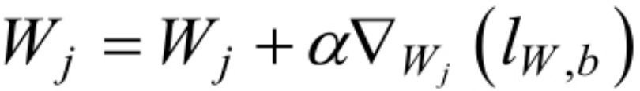

利利用上述的 Logistic Regression 中权重的更新公式，我们可以实现 Logistic Regression模型的训练，利用梯度下降法训练模型的具体过程

### Python实现对Logistic Regression模型的训练

```python
def lr_train_bgd(feature, label, maxCycle, alpha):
    '''利用梯度下降法训练LR模型
    input:  feature(mat)特征
            label(mat)标签
            maxCycle(int)最大迭代次数
            alpha(float)学习率
    output: w(mat):权重
    '''
    n = np.shape(feature)[1]  # 特征个数
    w = np.mat(np.ones((n, 1)))  # 初始化权重
    i = 0
    while i <= maxCycle:  # 在最大迭代次数的范围内
        i += 1  # 当前的迭代次数
        h = sig(feature * w)  # 计算Sigmoid值
        err = label - h
        if i % 100 == 0:
            print "\t---------iter=" + str(i) + \
            " , train error rate= " + str(error_rate(h, label))
        w = w + alpha * feature.T * err  # 权重修正
    return w
  
def error_rate(h, label):
    '''计算当前的损失函数值
    input:  h(mat):预测值
            label(mat):实际值
    output: err/m(float):错误率
    '''
    m = np.shape(h)[0]
    
    sum_err = 0.0
    for i in range(m):
        if h[i, 0] > 0 and (1 - h[i, 0]) > 0:
            sum_err -= (label[i,0] * np.log(h[i,0]) + \
                        (1-label[i,0]) * np.log(1-h[i,0]))#损失函数的计算过程
        else:
            sum_err -= 0
    return sum_err / m
```

函数lr_train_bgd使用了梯度下降法对Logistic Regression算法中的损失函数进行优化，在每一次迭代的过程中，需要计算当前的模型的误差，误差函数为 error_rate，在迭代的过程中，不断通过梯度下降的方法对Logistic Regression算法中的权重进行更新，

## 梯度下降法的若干问题

### 选择下降的方向

为了求解优化问题 f（w）的最小值，我们希望每次迭代的结果能够接近最优值w<sup>∗</sup> ，对于一维的情况，若当前点的梯度为负，则最小值在当前点的右侧，若当前点的梯度为正，则最小值在当前点的左侧，负的梯度即为下降的方向。有下述的更新规则：

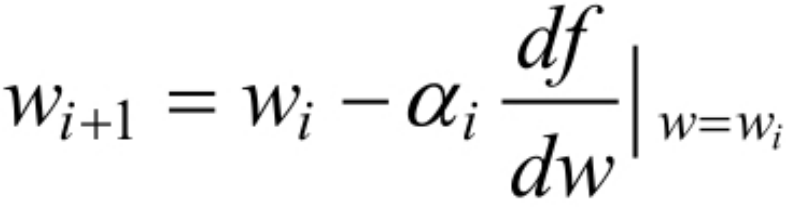

其中，*α*<sub>i</sub> 为步长。对于二维的情况，此时更新的规则如下：

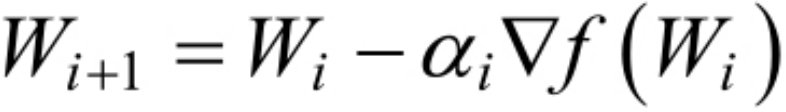

### 步长的选择

对于步长*α* 的选择，若选择太小，会导致收敛的速度比较慢；若选择太大，则会出现震荡的现象，即跳过最优解，在最优解附近徘徊，因此，选择合适的步长对于梯度下降法的收敛效果显得尤为重要。

##  **Logistic Regression**算法实践

利用已经完成的函数，构建Logistic Regression分类器，利用线性可分的数据作为训练样本来训练Logistic Regression模型，在构建模型的过程中，主要分为两个步骤：

1、利用训练样本训练模型；

2、利用训练好的模型对新样本进行预测

### 利用训练样本训练Logistic Regression模型

为了python能支持中文的注释和利用numpy工具，我们需要在训练文件“lr_train.py”的开始加入：

```python
# coding:UTF-8
import numpy as np
```

#### python实现训练模型的主函数

```python
# coding:UTF-8
'''
Date:20160901
@author: zhaozhiyong
@update: MoFeng
'''
import numpy as np

def load_data(file_name):
    '''导入训练数据
    input:  file_name(string)训练数据的位置
    output: feature_data(mat)特征
            label_data(mat)标签
    '''
    f = open(file_name)  # 打开文件
    feature_data = []
    label_data = []
    for line in f.readlines():
        feature_tmp = []
        lable_tmp = []
        lines = line.strip().split("\t")
        feature_tmp.append(1)  # 偏置项
        for i in range(len(lines) - 1):
            feature_tmp.append(float(lines[i]))
        lable_tmp.append(float(lines[-1]))
        
        feature_data.append(feature_tmp)
        label_data.append(lable_tmp)
    f.close()  # 关闭文件
    return np.mat(feature_data), np.mat(label_data)

def sig(x):
    '''Sigmoid函数
    input:  x(mat):feature * w
    output: sigmoid(x)(mat):Sigmoid值
    '''
    return 1.0 / (1 + np.exp(-x))

def lr_train_bgd(feature, label, maxCycle, alpha):
    '''利用梯度下降法训练LR模型
    input:  feature(mat)特征
            label(mat)标签
            maxCycle(int)最大迭代次数
            alpha(float)学习率
    output: w(mat):权重
    '''
    n = np.shape(feature)[1]  # 特征个数
    w = np.mat(np.ones((n, 1)))  # 初始化权重
    i = 0
    while i <= maxCycle:  # 在最大迭代次数的范围内
        i += 1  # 当前的迭代次数
        h = sig(feature * w)  # 计算Sigmoid值
        err = label - h
        if i % 100 == 0:
            print ("\t---------iter=" + str(i) + \
            " , train error rate= " + str(error_rate(h, label)))
        w = w + alpha * feature.T * err  # 权重修正
    return w

def error_rate(h, label):
    '''计算当前的损失函数值
    input:  h(mat):预测值
            label(mat):实际值
    output: err/m(float):错误率
    '''
    m = np.shape(h)[0]
    
    sum_err = 0.0
    for i in range(m):
        if h[i, 0] > 0 and (1 - h[i, 0]) > 0:
            sum_err -= (label[i,0] * np.log(h[i,0]) + \
                        (1-label[i,0]) * np.log(1-h[i,0]))
        else:
            sum_err -= 0
    return sum_err / m

def save_model(file_name, w):
    '''保存最终的模型
    input:  file_name(string):模型保存的文件名
            w(mat):LR模型的权重
    '''
    m = np.shape(w)[0]
    f_w = open(file_name, "w")
    w_array = []
    for i in range(m):
        w_array.append(str(w[i, 0]))
    f_w.write("\t".join(w_array))
    f_w.close()           

if __name__ == "__main__":
    # 1、导入训练数据
    print ("---------- 1.load data ------------")
    feature, label = load_data("data.txt")
    # 2、训练LR模型
    print ("---------- 2.training ------------")
    w = lr_train_bgd(feature, label, 1000, 0.01)
    # 3、保存最终的模型
    print ("---------- 3.save model ------------")
    save_model("weights", w)
    

```


### 最终的训练效果

```
---------- 1.load data ------------
---------- 2.training ------------
	---------iter=100 , train error rate= 0.0011343552118725198
	---------iter=200 , train error rate= 0.0009477843077847466
	---------iter=300 , train error rate= 0.0008150655965653185
	---------iter=400 , train error rate= 0.0007156807636573238
	---------iter=500 , train error rate= 0.0006383910251337728
	---------iter=600 , train error rate= 0.0005765152961049213
	---------iter=700 , train error rate= 0.0005258283298582945
	---------iter=800 , train error rate= 0.0004835251428600936
	---------iter=900 , train error rate= 0.0004476693385107398
	---------iter=1000 , train error rate= 0.0004168803688943547
---------- 3.save model ------------
```

最终得到LR模型的权重为：

W<sub>0</sub>=1.394177750874827	W<sub>1</sub>=4.527177129107415	W<sub>2</sub>=-4.793981623770908

（文件保存在“weights”文件中）

最终的分割超平面为


### 利用训练好的模型对新数据进行预测

1. 导入训练好的模型参数

   * 在load_weight函数中，其输入是权重所在的文件位置，在 

     导入函数中，将其数值导入到权重矩阵中。

2. 导入测试数据

   * 在导入测试集的 load_data 函数中，其输入为测试集的位置和特征的个数，其中特征的个数用于判断测试集是否符合要求，若不符合要求，则丢弃

3. 利用模型对新的数据进行预测

   * 在predict函数中，其输入为测试数据的特征和模型的权重，输出为最终的预测结果。通过特征与权重的乘积，再对其求Sigmoid 函数值得到最终的预测结果

   * 在计算最终的输出时，为了将Sigmoid函数输出的概率值转换成{0，1}，通常可以取0.5作为边界

   ```python
   for i in range(m):
     if h[i,0]<0.5:
       h[i,0] = 0.0
     else:
       h[i,0] = 1.0
   ```

4. 将预测结果保存在文件中

   * 函数 save_result 实现将预测结果存到指定的文件中，函数save_result 的输入为预测结果保存的文件名file_name 和预测的结果 result，最终将result中的数据写入到文件file_name中

```python
# coding:UTF-8
'''
Date:20160901
@author: zhaozhiyong
@updater: MoFeng
'''
import numpy as np
from lr_train import sig

def load_weight(w):
    '''导入LR模型
    input:  w(string)权重所在的文件位置
    output: np.mat(w)(mat)权重的矩阵
    '''
    f = open(w)
    w = []
    for line in f.readlines():
        lines = line.strip().split("\t")
        w_tmp = []
        for x in lines:
            w_tmp.append(float(x))
        w.append(w_tmp)    
    f.close()
    return np.mat(w)

def load_data(file_name, n):
    '''导入测试数据
    input:  file_name(string)测试集的位置
            n(int)特征的个数
    output: np.mat(feature_data)(mat)测试集的特征
    '''
    f = open(file_name)
    feature_data = []
    for line in f.readlines():
        feature_tmp = []
        lines = line.strip().split("\t")
        # print lines[2]
        if len(lines) != n - 1:
            continue
        feature_tmp.append(1)
        for x in lines:
            # print x
            feature_tmp.append(float(x))
        feature_data.append(feature_tmp)
    f.close()
    return np.mat(feature_data)

def predict(data, w):
    '''对测试数据进行预测
    input:  data(mat)测试数据的特征
            w(mat)模型的参数
    output: h(mat)最终的预测结果
    '''
    h = sig(data * w.T)#sig
    m = np.shape(h)[0]
    for i in range(m):
        if h[i, 0] < 0.5:
            h[i, 0] = 0.0
        else:
            h[i, 0] = 1.0
    return h

def save_result(file_name, result):
    '''保存最终的预测结果
    input:  file_name(string):预测结果保存的文件名
            result(mat):预测的结果
    '''
    m = np.shape(result)[0]
    #输出预测结果到文件
    tmp = []
    for i in range(m):
        tmp.append(str(result[i, 0]))
    f_result = open(file_name, "w")
    f_result.write("\t".join(tmp))
    f_result.close()    

if __name__ == "__main__":
    # 1、导入LR模型
    print("---------- 1.load model ------------")
    w = load_weight("weights")
    n = np.shape(w)[1]
    # 2、导入测试数据
    print ("---------- 2.load data ------------")
    testData = load_data("test_data", n)
    # 3、对测试数据进行预测
    print ("---------- 3.get prediction ------------")
    h = predict(testData, w)#进行预测
    # 4、保存最终的预测结果
    print ("---------- 4.save prediction ------------")
    save_result("result", h)
```

# Softmax Regression

