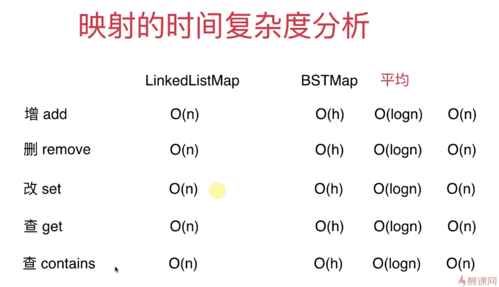

[TOC]

# 集合

* 承载元素的容器
* 存储的元素不可重复
* 可以用来去重
* 典型应用：客户统计、词汇量统计

##  集合的接口

```Java
public interface Set<E> {
    void add(E e);
    void remove(E e);
    boolean contains(E e);
    int getSize();
    boolean isEmpty();
}
```

## 二分搜索树实现集合

```Java
package com.practice.set;

import com.practice.tree.BST;

public class BSTSet<E extends Comparable<E>> implements Set<E> {
    private BST<E> bst;

    public BSTSet(){
        bst = new BST<>();
    }

    @Override
    public void add(E e) {
        bst.add(e);
    }

    @Override
    public void remove(E e) {
        bst.remove(e);
    }

    @Override
    public boolean contains(E e) {
        return bst.contains(e);
    }

    @Override
    public int getSize() {
        return bst.size();
    }

    @Override
    public boolean isEmpty() {
        return bst.isEmpty();
    }
}

```

## 链表实现集合

```Java
package com.practice.set;

import com.practice.linkedlist.LinkedList;

public class LinkedListSet<E> implements Set<E> {
    private LinkedList<E> list;

    public LinkedListSet(){
        list = new LinkedList<>();
    }

    @Override
    public void add(E e) {
        if (!list.contains(e)){
            list.addFirst(e);
        }
    }

    @Override
    public void remove(E e) {
        list.removeElement(e);
    }

    @Override
    public boolean contains(E e) {
        return list.contains(e);
    }

    @Override
    public int getSize() {
        return list.getSize();
    }

    @Override
    public boolean isEmpty() {
        return list.isEmpty();
    }
}

```

## 复杂度分析


# 映射(Map，字典)

## 映射的接口

```Java
public interface Map<K,V> {
    void add(K key,V value);
    V remove(K key);
    boolean contains(K key);
    V get(K key);
    void set(K key,V newValue);
    int getSize();
    boolean isEmpty();

```

## 二叉树实现映射

```java
package com.practice.map;

public class BSTMap<K extends Comparable<K>,V>implements Map<K,V> {

    class Node{
        public K key;
        public V value;
        public Node left;
        public Node right;

        public Node(K key,V value){
            this.key = key;
            this.value = value;
            this.left = null;
            this.right = null;
        }

        @Override
        public String toString() {
            return "Node{" +
                    "key=" + key +
                    ", value=" + value +
                    '}';
        }
    }

    private Node root;
    private int size;
    public BSTMap(){
        root = null;
        size = 0;
    }


    @Override
    public void add(K key, V value) {
        root = add(root,key,value);
    }
    private Node add(Node node,K key, V value){
        //如果为空就创建一个结点返回（作为根节点）
        if (node == null){
            size++;
            return new Node(key, value);
        }
        //如果key比当前节点的key小则去该节点的左子树进行添加操作
       if (key.compareTo(node.key)<0){
            node.left = add(node.left,key,value);
        }
       //如果key比当前节点的key大，则去该节点的右子树进行添加操作
        else if (key.compareTo(node.key)>0){
            node.right = add(node.right,key,value);
        }
        else {
            //如果相等就直接赋值
            node.value = value;
        }
        return node;
    }

    @Override
    public V remove(K key) {
        //先找到这个节点
        Node node = getNode(key);
        //如果这个节点不为空就执行删除操作
        if (node!=null){
            root = remove(root,key);
            //返回删除的节点的值
            return node.value;
        }
        return null;
    }

    /**
     * 执行删除操作
     * @param node
     * @param key
     * @return
     */
    private Node remove(Node node,K key){
        //如果传入节点为空，返回空
        if (node==null){
            return null;
        }
        //如果key值小于当前节点的key值，递归执行左子树结点
        if (key.compareTo(node.key)<0){

            node.left=remove(node.left,key);
            return node;
            //如果key值大于当前结点的key值，递归执行右子树结点
        }else if (key.compareTo(node.key)>0){
            node.right = remove(node.right,key);
            return node;
        }else {
            //key值相等执行删除
            //待删点左子树为空的情况
            if (node.left == null){
                Node rightNode = node.right;
                node.right = null;
                size--;
                return rightNode;
            }
            //待删节点右子树为空的情况
            if (node.right == null){
                Node leftNode = node.left;
                node.left = null;
                size --;
                return leftNode;
            }
            //左右子树都存在的情况，找到其右子树中最小的结点，替代自己的位置
            Node successor = minimum(node.right);
            successor.right =  (node.right);
            successor.left = node.left;

            node.left = node.right = null;
            return node;
        }
    }
    //删除掉以node为根的二分搜索树中的最小节点
    //返回删除节点后新的二分搜索树的根
    private Node removeMin(Node node){
        if (node.left == null){
            Node rightNode = node.right;//保存待删结点的右子树
            node.right = null;
            size--;
            return rightNode;
        }
        node.left = removeMin(node.left);
        return node;
    }


    private Node minimum(Node node){
        if (node.left == null){
            return node;
        }
        return minimum(node.left);
    }

    @Override
    public boolean contains(K key) {
        return getNode(key)!=null;
    }

    @Override
    public V get(K key) {
        Node node = getNode(key);
        return node==null ? null : node.value;
    }

    private Node getNode(K key){
        return getNode(root,key);
    }
    private Node getNode(Node node,K key){
        if (node==null){
            return null;
        }
        if (key.compareTo(node.key)<0){
            return getNode(node.left,key);
        }
        else if (key.compareTo(node.key)>0){
            return getNode(node.right,key);
        }
        return node;
    }

    @Override
    public void set(K key, V newValue) {
        Node node = getNode(key);
        node.value = newValue;
    }

    @Override
    public int getSize() {
        return size;
    }

    @Override
    public boolean isEmpty() {
        return size==0;
    }
}

```


## 映射的时间复杂度分析



## 有序映射和无序映射

* 有序映射中的键具有顺序性
  * 基于搜索树实现
* 无序映射中的键没有顺序性
  * 基于哈希表实现

## 多重映射

* 多重映射中的键是可以重复的


