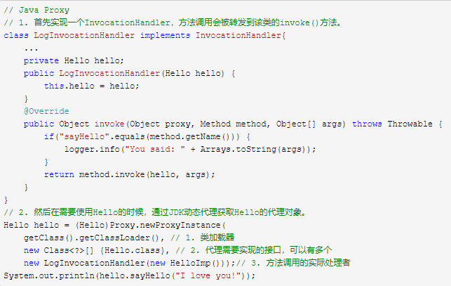

[toc]


## 一、基础能力面试

### 1、HashMap的实现机构原理，Java8对HashMap的机构做了哪些优化

https://blog.csdn.net/weixin_41719737/article/details/83551954

HashMap的链表元素对应的是一个静态内部类Entry，Entry主要包含key，value，next三个元素

主要有put和get方法，put的原理是，通过hash%Entry.length计算index，此时记作Entry[index]=该元素。如果index相同

就是新入的元素放置到Entry[index]，原先的元素记作Entry[index].next

get就比较简单了，先遍历数组，再遍历链表元素。

null key总是放在Entry数组的第一个元素

解决hash冲突的方法：链地址法

再散列rehash的过程：确定容量超过目前哈希表的容量，重新调整table 的容量大小，当超过容量的最大值时，取Integer.Maxvalue

补充：

​	X.equals(Y)=true则他们的hashcode应当相同，如果两个对象的hashcode相同，它们并不一定相同

#### 数组和链表的区别：

1 链表在内存是是不连续的，数组是连续的

2 数组内存分配是一次性的全部分配，链表不是

3 数组是同级别的，链表是一个连接一个，查找效率链表不如数组

4 链表的增删比数组方便

5 链表的扩展潜力大于数组 

#### JDK8中对HashMap做了怎样的优化

1.生成一个entry初始容量16的数组+链表结构,使用容量大于0.75f时,自动扩容2^n

2.当链表长度大于8时,转化为红黑树结构.

### 2、java线程池中coreSize,maxSize,queueLength,keepAliveTime,rejectStrategy那么多参数之间的联系和相互作用的影响是什么?

https://blog.csdn.net/aitangyong/article/details/38822505

**corePoolSize**：线程池的基本大小，即在没有任务需要执行的时候线程池的大小，并且只有在工作队列满了的情况下才会创建超出这个数量的线程

**maximumPoolSize**：线程池中允许的最大线程数，线程池中的当前线程数目不会超过该值

**poolSize**：线程池中当前线程的数量，当该值为0的时候，意味着没有任何线程，线程池会终止；同一时刻，poolSize不会超过maximumPoolSize

新提交一个任务时的处理流程很明显：
1、如果线程池的当前大小还没有达到基本大小(poolSize < corePoolSize)，那么就新增加一个线程处理新提交的任务；

2、如果当前大小已经达到了基本大小，就将新提交的任务提交到阻塞队列排队，等候处理workQueue.offer(command)；

3、如果队列容量已达上限，并且当前大小poolSize没有达到maximumPoolSize，那么就新增线程来处理任务；

4、如果队列已满，并且当前线程数目也已经达到上限，那么意味着线程池的处理能力已经达到了极限，此时需要拒绝新增加的任务。至于如何拒绝处理新增的任务，取决于线程池的饱和策略RejectedExecutionHandler。

通过corePoolSize和maximumPoolSize，控制如何新增线程；

通过allowCoreThreadTimeOut和keepAliveTime，控制如何销毁线程

**allowCoreThreadTimeOut**

该属性用来控制是否允许核心线程超时退出。If false,core threads stay alive even when idle.If true, core threads use keepAliveTime to time out waiting for work。如果线程池的大小已经达到了corePoolSize，不管有没有任务需要执行，线程池都会保证这些核心线程处于存活状态。可以知道：该属性只是用来控制核心线程的
**keepAliveTime**

如果一个线程处在空闲状态的时间超过了该属性值，就会因为超时而退出。举个例子，如果线程池的核心大小corePoolSize=5，而当前大小poolSize =8，那么超出核心大小的线程，会按照keepAliveTime的值判断是否会超时退出。如果线程池的核心大小corePoolSize=5，而当前大小poolSize =5，那么线程池中所有线程都是核心线程，这个时候线程是否会退出，取决于allowCoreThreadTimeOut。

### 3、java并发处理的方式有哪些?

问的基本都是，Java多线程的实现方式，线程安全方面，下面这个博客讲的非常详细

https://blog.csdn.net/a_blackmoon/article/details/79860114

### 4、jvm分为哪几个区，他们之间的关系如何，gc时会做哪些事情

#### 程序计数器PC

* 线程私有的
* 它可以看做是当前线程所执行的字节码的行号指示器
* 内存区域中唯一一个没有规定任何OutOfMemoryError的区域

#### Java虚拟机栈

* 线程私有的
* 每个方法在执行的同时都会创建一个栈帧，用于存储局部变量表、操作数栈、动态链接、方法出口等信息
* 如果线程请求的栈深度大于虚拟机所允许的深度，将抛出StackOverFlowError异常；如虚拟机扩展时仍无法申请到足够的内存，就会抛出OutOfMemoryError异常

#### 本地方法栈

* 与虚拟机栈非常相似，区别是虚拟机栈为虚拟机执行Java方法服务，而本地方法栈则为虚拟机使用Native方法服务，也会抛出StackOverFlowError和OutOfMemoryError异常

#### Java堆

* 线程共享的
* Java堆是GC管理的主要区域
* 在虚拟机启动时创建
* 存放对象实例，几乎所有的对象实例和数组都在这里分配内存
* 如果在堆中没有内存完成实例分配，并且堆也无法再扩展时，将会抛出OutOfMemoryError异常

#### 方法区

* 线程共享的
* 用于存储已被虚拟机加载的类信息、常量、静态变量、即使编译器编译后的代码等数据
* 当方法区无法满足内存分配需求时，将抛出OutOfMemoryError异常

#### 运行时常量池（在方法区中）

* 是方法区的一部分
* 用于存放编译器生成的各种字面量和符合引用
* 相对于Class文件常量池的一个重要特征是，具备动态性
* 运行时常量池是方法区的一部分，自然受到方法区内存的限制，当常量池无法再申请到内存时会抛出OutOfMemoryError异常

每一个区是干嘛的如下博客：

https://blog.csdn.net/ma345787383/article/details/77099262

https://blog.csdn.net/weixin_39046924/article/details/80443619

#### GC时会做哪些事情

1. 在什么时候GC

   GC堆内存分为三部分：Young Generation，Old Generation，Permanent Generation。Young Generation 分为：Eden , Survivor1 , Survivor2， 新创建的对象会分配在Eden区,在经历一次Minor GC后会被移到Survivor 1区，再经历一次Minor GC后会被移到Survivor 2区，直到升至老年代,需要注意的是，一些大对象(长字符串或数组)可能会直接存放到老年代；升到老年代的对象大于剩余空间时，会发生[Full GC](https://www.jianshu.com/writer#/notebooks/4879117/notes/16207262)，或者小于时，查看是否设置了XX:+HandlePromotionFailure(允许担保失败)参数，若允许，则只会进行Minor GC，此时可以容忍内存分配失败；若不允许，强制Full GC。GC与非GC时间耗时超过了GCTimeRatio的限制引发OOM，调优诸如通过NewRatio控制新生代老年代比例，通过MaxTenuringThreshold控制进入老年前生存次数等。
   
2. 对什么东西GC

   从GC root 开始搜索，搜索不到的对象和经过第一次标记、清理后仍旧没复活的对象，这类对象会被GC

3. GC做了什么事

   按照各部分的收集器进行空间回收，其中涉及到的收集器和GC算法参见另两篇文章：

   [收集器](https://www.jianshu.com/writer#/notebooks/4879117/notes/16207262) 和[GC算法](https://www.jianshu.com/writer#/notebooks/4879117/notes/16203704)。

   ​    新生代做复制清理、老年代做的是标记整理、标记清除

   参考链接：https://www.jianshu.com/p/a5fb04ff58c3

## 二、Javaweb的知识

### 1、http协议get和post的区别

#### （一）从HTTP报文来看

​	Get请求方式将请求信息放在URL后面，请求信息和URL之间以？隔开，请求信息的格式为键值对，例如：

[https://www.baidu.com/s?ie=utf-8&f=8&rsv_bp=1&rsv_idx=1&tn=baidu&wd=http%E5%8D%8F%E8%AE%AEget%E5%92%8Cpost%E7%9A%84%E5%8C%BA%E5%88%AB&oq=G%2526lt%253B%25E6%2597%25B6%25E4%25BC%259A%25E5%2581%259A%25E5%2593%25AA%25E4%25BA%259B%25E4%25BA%258B%25E6%2583%2585&rsv_pq=e4503fff0000a682&rsv_t=dbf0XT9tpCcXdlo2OLM0kOANQJEUaHE39tTWepQIzcSmxI9rEGbLplOr6%2Fo&rqlang=cn&rsv_enter=1&rsv_dl=tb&rsv_sug3=1&rsv_sug2=0&inputT=639&rsv_sug4=639](https://www.baidu.com/s?ie=utf-8&f=8&rsv_bp=1&rsv_idx=1&tn=baidu&wd=http协议get和post的区别&oq=G%26lt%3B%E6%97%B6%E4%BC%9A%E5%81%9A%E5%93%AA%E4%BA%9B%E4%BA%8B%E6%83%85&rsv_pq=e4503fff0000a682&rsv_t=dbf0XT9tpCcXdlo2OLM0kOANQJEUaHE39tTWepQIzcSmxI9rEGbLplOr6%2Fo&rqlang=cn&rsv_enter=1&rsv_dl=tb&rsv_sug3=1&rsv_sug2=0&inputT=639&rsv_sug4=639)

这种请求方式将请求信息直接暴露在URL中，安全性较低，另外从报文结构来看，由于请求信息放置在URL中，因此请求报文中不需要报文体。

​	POST请求方式将请求信息放置在报文体中，相获得请求信息必须解析报文，因此安全性较GET方式要高一些（事实上要获得报文体中的请求信息也是很容易的，因此安全性上两者并没有太多的区别，具体解决传输过程中的安全性问题要靠HTTPS），此外在请求报文中含有报文体。

​	由于GET中的请求信息放置在URL中，因此是由长度限制的，因为URL本身是有长度限制的，POST中的请求信息是放置在报文体中，因此对数据长度是没有限制的

#### （二）从数据库层面来看

​	GET请求方式符合幂等性和安全性，（幂等性的定义：堆数据库的一次操作和多次操作获得的结果是一致的，则认为符合幂等性。安全性的定义：对数据库的操作没有改变数据库中的数据，则认为符合安全性），GET请求方式是做查询操作中间对数据库中的数据作了更改），从这来说是不符合幂等性的定义，但是因为GET请求只是查询数据库，不会对数据库做任何更改，因此也认为是幂等的。

​	POST请求方式是既不幂等又不安全，首先POST请求方式往数据库中提交数据，因此会改变数据库中的数据，其次，POST请求方式每次获得的结果都有可能不一样，因为POST请求是作用在上一级的URL上的，则每一次请求都会添加一份新资源（这也是POST和PUT方式的最大区别，PUT方式是幂等的）

**注意：在这里提到的安全性不同于上一部分，不要混淆**

#### （三）从其他层面来看

GET请求能够被缓存

GET请求会保存在浏览器的浏览记录中

以GET请求的URL能够保存为浏览器的书签

而POST方式都不具备上述功能。缓存也是GET请求被广泛应用的根本，在现代网络上每天产生的请求数目是巨大的，并且其中绝大部分请求均为只读请求，如果所有的这些请求都要交由Web服务器直接处理，这无疑是巨大的资源浪费。从第二部分知道GET表达的是一种幂等的、安全的，它除了返回结果不应该会产生其他副作用，因此绝大部分GET请求（通常超过90%）都直接被CDN缓存了，这能大大减少Web服务器的负担。而POST是非幂等的，有副作用的操作，所以必须交由Web服务器处理

### 2、servlet的原理是什么？讲一下它的一个完整的生命周期？

出自：[csdn博客](https://blog.csdn.net/weixin_34301132/article/details/86033142)

Servlet生命周期分为三个阶段：

* 初始化阶段						调用init()方法
* 响应客户端请求阶段         调用service()方法
* 终止阶段                              调用destroy()方法


servlet初始化阶段：

​	在下列时刻Servlet容器装载Servlet：

* Servlet容器启动时自动装载某些Servlet，实现它只需要在web.xml文件中的servlet标签之间添加如下代码

  ```xml
  <loadon-startup>1</loadon-startup>
  ```

* 在Servlet容器启动后，客户首次向Servlet发送请求

* Servlet类文件被更新后，重新装载Servlet

Servlet被装载后，Servlet容器创建一个Servlet实例并且调用Servletinit()方法进行初始化，在Servlet整个生命周期内，init()方法只被调用一次


#### Servlet工作原理：

​		首先简单解释一下Servlet接收和响应客户请求的过程，首先客户发送一个请求，Servlet是调用service()方法对请求进行响应的，通过源代码可见，service()方法中对请求的方式进行了匹配，选择调用doGet,doPost等这些方法，然后再进入对应的方法中调用逻辑层的方法，实现对客户的响应。在Servlet接口和GenericServlet中是没有doGet,doPost等等这些方法的，HttpServlet中定义了这些方法，但是都是返回error信息，所以，我们每次定义一个Servlet的时候，都必须实现doGet或doPost等这些方法。

　　每一个自定义的Servlet都必须实现Servlet的接口，Servlet接口中定义了五个方法，其中比较重要的三个方法涉及到Servlet的生命周期，分别是上文提到的init(),service(),destroy()方法。GenericServlet是一个通用的，不特定于任何协议的Servlet,它实现了Servlet接口。而HttpServlet继承于GenericServlet，因此HttpServlet也实现了Servlet接口。所以我们定义Servlet的时候只需要继承HttpServlet即可。

　　Servlet接口和GenericServlet是不特定于任何协议的，而HttpServlet是特定于HTTP协议的类，所以HttpServlet中实现了service()方法，并将请求ServletRequest,ServletResponse强转为HttpRequest和HttpResponse。

​      代码的最后调用了HTTPServlet自己的service(request,response)方法，然后根据请求去调用对应的doXXX方法，因为HttpServlet中的doXXX方法都是返回错误信息，所以需要我们在自定义的Servlet中override这些方法！

<hr>

**Servlet响应请求阶段：**

​	对于用户到达Servlet的请求，Servlet容器会创建特定于这个请求的ServletRequest对象和ServletResponse对象，然后低啊用Servlet的service方法。service方法从ServletRequest对象获得客户请求信息处理该请求，并通过ServletResponse对象向客户返回响应信息。

​	对于Tomcat来说，它会将传递过来的参数放在一个Hashtable中，该Hashtable的定义是

```java
private Hashtable<String String[]> paramHashStringArray = new Hashtable<String String[]>();
```

这是一个String->String[]的键值映射


<hr>

**Servlet终止阶段：**

​	当web应用被终止，或Servlet容器终止运行，或Servlet容器重新装载Servlet新实例时，Servlet容器会先调用Servlet的destroy()方法，在destroy()方法中可以释放掉Servlet所占用的资源

<hr>

**Servlet何时被创建：**

* 默认情况下，当web客户第一次请求访问某个Servlet的时候，web容器将创建这个Servlet的实例
* 当web.xml文件中如果Servlet标签中指定了<load-on-startup>子元素时，Servlet容器在启动web服务器时，将按照顺序创建并初始化Servlet对象

注意：在web.xml文件中，某些Servlet只有<serlvet>元素，没有<servlet-mapping>元素，这样我们无法通过url的方式访问这些Servlet，这种Servlet通常会在<servlet>元素中配置一个<load-on-startup>子元素，让容器在启动的时候自动加载这些Servlet并调用init()方法，完成一些全局性的初始化工作。

Web应用何时被启动：

　　1，当Servlet容器启动的时候，所有的Web应用都会被启动

　　2，控制器启动web应用

<hr>

**Servlet与JSP的比较：**

* 有很多相似之处，都可以生成动态网页
* JSP的有点是擅长于网页制作，生成动态页面比较直观，缺点是不容易跟踪与排错
* Servlet是纯java语言，擅长于处理流程和业务逻辑，缺点是生成动态网页不直观

### 3、多个http请求若要访问同一个变量的时候一般怎么处理，是用threadLocal还是直接用单例访问，各有什么优缺点？

（考察对web项目多线程处理中单例及threadLocal的理解）

[参考博客https://blog.csdn.net/wu2374633583/article/details/80880203](https://blog.csdn.net/wu2374633583/article/details/80880203)

* **ThreadLocal**

​		ThreadLocal：线程局部变量，是一种多线程间并发访问变量的一种解决方案，与其synchronized加锁的方式不同，**它完全不提供锁，而使用以空间换时间的手段，为每个线程提供变量的独立副本，以保障线程安全。**
​		从性能上说，ThreadLocal不具有绝对优势，在并发不是很高的情况下，加锁的性能会更好，但是作为一套与锁完全无关的线程安全解决方案，**在高并发或者竞争激烈的场景下，使用ThreadLocal可以在一定程度上减少锁竞争问题。**

​		**尽管使用的是全局的变量，但是线程之间值是不会相互影响的，也就是线程安全。**

<hr>

* **单例模式**

最常见的就是饥饿模式和懒汉模式，一个是直接实例化对象，一个在调用方法时候进行实例化对象，**在多线程模式中，考虑到性能和线程安全问题，我们一般选用下面两种经典模式，在提高性能的同时，又保证了线程安全**。

**Double check instance**

```java
/**
 * dubble check instance 单例模式
 * @author Administrator
 *
 */
public class MyThread01 {

    private static MyThread01 mt;
    public static MyThread01 getMt(){
        if(mt==null){
            try {
                Thread.sleep(3000);
            } catch (InterruptedException e) {
                // TODO Auto-generated catch block
                e.printStackTrace();
            }
            synchronized (MyThread01.class) {
                if(mt==null){
                    mt=new MyThread01();
                }
            }
        }

        return mt;
    }
}
```

**static inner class(静态内部类，更常用)**

```java
/**
 * static inner class 单例模式 静态内部类
 * @author Administrator
 *
 */
public class MyThread02 {

    public static class InnerSingletion{
        private static MyThread02 mt=new MyThread02();

    }

    public  static MyThread02 getInstance(){

        return InnerSingletion.mt;
    }
}

```

## Java框架

### 1、spring的DI,AOP,IOC的原理和应用分别是什么？

（首先要谈好原理（动态代理，cglib代理，扩展等），然后再谈应用）

[参考博客https://www.jianshu.com/p/3767dca59b56](https://www.jianshu.com/p/3767dca59b56)

#### springAOP原理：JDK动态代理

动态代理实现原理：一个实现接口的类可以做动态代理



在我们需要代理的时候写入这些代码

Proxy.newProxyInstance(ClassLoader loader, Class<?>[] interfaces, InvocationHandler handler)

参数1，实现接口也就是代理对象的类加载器

参数2，实现的接口

参数3，实现invocationhandler接口的类

因此，JDK代理会把所有实现接口的方法转发到invocationhandler中的invoke方法中，我们可以在这里实现任何的逻辑要求

AOP使用场景概述：

Persistence　　持久化

Synchronization　同步

Transactions 事务

#### spring IOC 和 SpringDI原理：Java反射

IOC容器通过Java反射技术利用Java注解（Autowired和Resource）根据配置文件初始化对象注入到类中

IOC的初衷：解耦

依赖注入(**DI**)和控制反转(**IOC**)是从不同的角度的描述的同一件事情，就是指通过引入IOC容器，利用依赖关系注入的方式，实现对象之间的解耦。

依赖注入(DI)和控制反转(IOC)是从不同的角度的描述的同一件事情，就是指**通过引入IOC容器，利用依赖关系注入的方式，实现对象之间的解耦**。

既然IOC是控制反转，那么到底是“哪些方面的控制被反转了呢？”，经过详细地分析和论证后，他得出了答案：“**获得依赖对象的过程被反转了**”。控制被反转之后，获得依赖对象的过程由自身管理变为了由IOC容器主动注入。于是，他给“控制反转”取了一个更合适的名字叫做“依赖注入（Dependency Injection）”。他的这个答案，实际上给出了实现IOC的方法：注入。所谓依赖注入，就是由IOC容器在运行期间，动态地将某种依赖关系注入到对象之中。
[参考博文](https://blog.csdn.net/m13666368773/article/details/7802126)

### 2、spring bean有哪几种作用域，bean的生命周期是怎样的？

（bean的理解）

Bean scopes

| Scope                                                        | Description                                                  |
| :----------------------------------------------------------- | :----------------------------------------------------------- |
| [singleton](https://docs.spring.io/spring/docs/5.1.4.RELEASE/spring-framework-reference/core.html#beans-factory-scopes-singleton) | (Default) Scopes a single bean definition to a single object instance for each Spring IoC container. |
| [prototype](https://docs.spring.io/spring/docs/5.1.4.RELEASE/spring-framework-reference/core.html#beans-factory-scopes-prototype) | Scopes a single bean definition to any number of object instances. |
| [request](https://docs.spring.io/spring/docs/5.1.4.RELEASE/spring-framework-reference/core.html#beans-factory-scopes-request) | Scopes a single bean definition to the lifecycle of a single HTTP request. That is, each HTTP request has its own instance of a bean created off the back of a single bean definition. Only valid in the context of a web-aware Spring `ApplicationContext`. |
| [session](https://docs.spring.io/spring/docs/5.1.4.RELEASE/spring-framework-reference/core.html#beans-factory-scopes-session) | Scopes a single bean definition to the lifecycle of an HTTP `Session`. Only valid in the context of a web-aware Spring `ApplicationContext`. |
| [application](https://docs.spring.io/spring/docs/5.1.4.RELEASE/spring-framework-reference/core.html#beans-factory-scopes-application) | Scopes a single bean definition to the lifecycle of a `ServletContext`. Only valid in the context of a web-aware Spring `ApplicationContext`. |
| [websocket](https://docs.spring.io/spring/docs/5.1.4.RELEASE/spring-framework-reference/web.html#websocket-stomp-websocket-scope) | Scopes a single bean definition to the lifecycle of a `WebSocket`. Only valid in the context of a web-aware Spring `ApplicationContext`. |

中文版

| 作用域                                                       | 描述                                                         |
| :----------------------------------------------------------- | :----------------------------------------------------------- |
| [singleton](https://docs.spring.io/spring/docs/5.1.4.RELEASE/spring-framework-reference/core.html#beans-factory-scopes-singleton) | (默认) 在每个SpringIOC容器中，一个bean定义对应只会有唯一的一个bean实例 |
| [prototype](https://docs.spring.io/spring/docs/5.1.4.RELEASE/spring-framework-reference/core.html#beans-factory-scopes-prototype) | Scopes a single bean definition to any number of object instances. |
| [request](https://docs.spring.io/spring/docs/5.1.4.RELEASE/spring-framework-reference/core.html#beans-factory-scopes-request) | 一个bean定义对应于单个HTTP请求的生命周期，也就是说，每个HTTP请求都有一个bean实例，且该实例仅在这个HTTP请求的生命周期里有效，该作用域 仅在支持web的Spring“ApplicationContext”上下文中有效。 |
| [session](https://docs.spring.io/spring/docs/5.1.4.RELEASE/spring-framework-reference/core.html#beans-factory-scopes-session) | 一个bean定义对应于单个HTTP `Session`生命周期. 也就是说，每个HTTP Session都有一个bean实例，且该实例仅在这个HTTP Session的生命周期里有效，仅在支持web的Spring“ApplicationContext”上下文中有效。 |
| [application](https://docs.spring.io/spring/docs/5.1.4.RELEASE/spring-framework-reference/core.html#beans-factory-scopes-application) | 将单个bean定义的作用域限定为“ServletContext”的生命周期。仅在支持web的Spring“ApplicationContext”上下文中有效。 |
| [websocket](https://docs.spring.io/spring/docs/5.1.4.RELEASE/spring-framework-reference/web.html#websocket-stomp-websocket-scope) | 将单个bean定义的作用域限定为“WebSocket”的生命周期。仅在支持web的Spring“ApplicationContext”上下文中有效。 |

### 3、SpringBoot有接触吗？谈谈你对它的理解，它为什么好？

（加分项，可以谈谈以前没有SpringBoot时配置一个东西有多么坑，有了SpringBoot后多么简单，然后一定要从原理上说为什么SpringBoot简单了，这样又可以体现你研究过SpringBoot的原理，又能用它去解决问题）

优点

* 快速创建独立运行的Spring项目以及与主流框架集成
* 使用嵌入式的Servlet容器，应用无需打成WAR包
* starters自动依赖于版本控制
* 大量的自动配置，简化开发，也可修改默认值
* 无需配置XML，无代码生成，开箱即用
* 准生产环境的运行时应用监控
* 与云计算的天然集成

### 4、mybatis的orm相关知识？

（着手从orm的原理到mybatis的应用开始谈，然后讲讲mybatis的sql自动生成以及分页插件等，体现在项目中的实战一点都不少）

orm（对象关系映射object relative mapping）

mybatis提供了Mapper的动态代理对象，当我们调用接口中的函数时，动态代理对象调用invoke方法，但其中并没有调用接口的方法，而是自己根据接口的全限定名和函数名到配置文件中去寻找对应的SQL语句，接着执行这条SQL语句，这就是为什么我们在配置文件中要指明namespace与id值的原因
[mybatis参考资料](https://blog.csdn.net/dhaiuda/article/details/80094226)

## 数据库技能

## 1、mysql的事务隔离级别分别有哪几种，每种分别可以解决哪些问题，又不能解决哪些问题？

（考察队数据库事务的理解能力，在理解这个问题之前大家要西安利捷清楚什么叫读快照，什么叫读当前。大家可以先学一下这篇文章 [传送门1](https://blog.csdn.net/hzllblzjily/article/details/50634582) [传送门2](https://blog.csdn.net/hzllblzjily/article/details/50633918)）

[参考资料](https://blog.csdn.net/hzllblzjily/article/details/50634582)

**MVCC：Snapshot Read vs Current Read**

MySQL InnoDB存储引擎，实现的是基于多版本的并发控制协议——MVCC ([Multi-Version Concurrency Control](http://en.wikipedia.org/wiki/Multiversion_concurrency_control)) (注：与MVCC相对的，是基于锁的并发控制，Lock-Based Concurrency Control)。MVCC最大的好处，相信也是耳熟能详：读不加锁，读写不冲突。在读多写少的OLTP应用中，读写不冲突是非常重要的，极大的增加了系统的并发性能，这也是为什么现阶段，几乎所有的RDBMS，都支持了MVCC。

在MVCC并发控制中，读操作可以分成两类：快照读 (snapshot read)与当前读 (current read)。快照读，读取的是记录的可见版本 (有可能是历史版本)，不用加锁。当前读，读取的是记录的最新版本，并且，当前读返回的记录，都会加上锁，保证其他事务不会再并发修改这条记录。

- **快照读：**简单的select操作，属于快照读，不加锁。(当然，也有例外，下面会分析)
  - select * from table where ?;

- **当前读：**特殊的读操作，插入/更新/删除操作，属于当前读，需要加锁。
  - select * from table where ? lock in share mode;
  - select * from table where ? for update;
  - Insert into table values();
  - Update table set ?  where ?;
  - delete from table where ?;
  - 所有以上的语句都属于当前读，读取记录的最新版本，并且，读取之后，还需要保证其他并发事务不能修改当前记录，对读取记录加锁。其中，除了第一条语句，对读取记录加S锁（共享锁）外，其他的操作，都加的是X锁（排它锁）。

**Isolation Level**

隔离级别：[Isolation Level](http://en.wikipedia.org/wiki/Isolation_(database_systems))，也是RDBMS的一个关键特性。相信对数据库有所了解的朋友，对于4种隔离级别：Read Uncommited，Read Committed，Repeatable Read，Serializable，都有了深入的认识。本文不打算讨论数据库理论中，是如何定义这4种隔离级别的含义的，而是跟大家介绍一下MySQL/InnoDB是如何定义这4种隔离级别的。

MySQL/InnoDB定义的4种隔离级别：

- **Read Uncommited**
  可以读取未提交记录。此隔离级别，不会使用，忽略。

- **Read Committed (RC)**
  快照读忽略，本文不考虑。

  针对当前读，**RC隔离级别保证对读取到的记录加锁 (记录锁)**，存在幻读现象。

- **Repeatable Read (RR)**
  快照读忽略，本文不考虑。

  针对当前读，**RR隔离级别保证对读取到的记录加锁 (记录锁)，同时保证对读取的范围加锁，新的满足查询条件的记录不能够插入 (间隙锁)**，不存在幻读现象。

- **Serializable**
  从MVCC并发控制退化为基于锁的并发控制。不区别快照读与当前读，所有的读操作均为当前读，读加读锁 (S锁)，写加写锁 (X锁)。

  Serializable隔离级别下，读写冲突，因此并发度急剧下降，在MySQL/InnoDB下不建议使用。

### 2、mysql索引的结构是什么样的？查询效率又如何？

（学完上述内容再谈索引结构和查询效率，大家要记住，**主键查询即便上亿数据都可以无压力，唯一键查询和主键基本相当，非唯一索引区分度好的千万级别数据无压力，区分度差一点的百万级别能凑活，再上去一点就不行了**）

目前大部分数据库系统及文件系统都采用B Tree或其变种B+Tree作为索引结构

相关概念介绍

- B-树（B树）：多路搜索树，每个结点存储M/2到M个关键字，非叶子结点存储指向关键字范围的子结点；所有关键字在整颗树中出现，且只出现一次，非叶子结点可以命中；
- B+树：在B-树基础上，为叶子结点增加链表指针，所有关键字都在叶子结点中出现，非叶子结点作为叶子结点的索引；B+树总是到叶子结点才命中；
- B*树：在B+树基础上，为非叶子结点也增加链表指针，将结点的最低利用率从1/2提高到2/3；

红黑树也可用来实现索引，但是文件系统及数据库系统普遍采用B/+Tree,为什么？

一般来说，索引本身也很大，不可能全存内存，往往以索引文件的形式存在磁盘

　(1)单节点能存储更多数据，使得磁盘IO次数更少。

　(2)叶子节点形成有序链表，便于执行范围操作。

　(3)聚集索引中，叶子节点的data直接包含数据；非聚集索引中，叶子节点存储数据地址的指针。

## 分布式

### 1、有没有勇敢什么rpc框架，rpc的基本原理是怎么样的，如何实现一个自己的rpc框架

（聊聊dubbo，聊聊springcloud，看你用过哪个，可以先简单的讲一讲具体的应用和解决的问题，再深入原理讲其实现方式，若你了解实现方式，那么怎么实现一个rpc框架就不算是问题了）


### 2、分布式环境下如何解决事务的问题

（最show能力的时候到了，什么都别说，先聊cap和base理论，讲明分布式环境下要么确保一致性牺牲可用性，典型（二阶段提交性事务），要么确保可用性牺牲一致性但要确保最终一致性，例如（最大努力提交性事务）可用消息中间件确保消息最终成功消费实现。tcc型事务，可用事后回滚型方式解决，补偿性事务，可以谈谈异常定时处理机制等）

